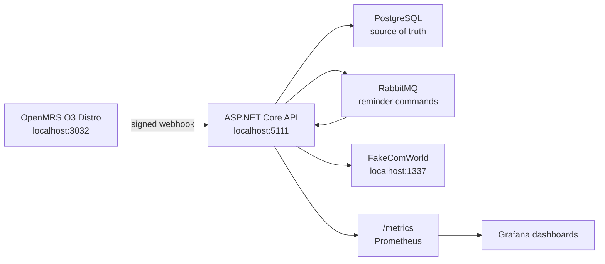
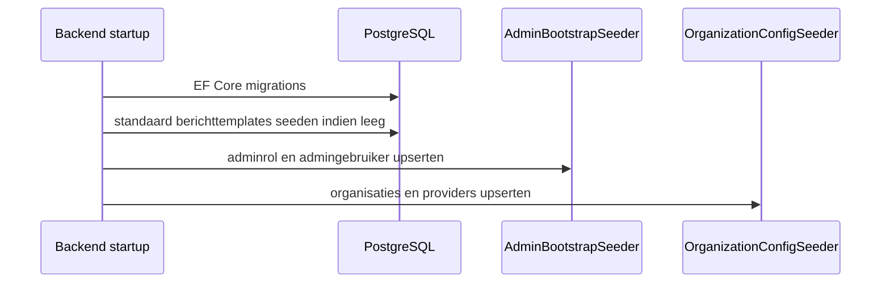

# OpenMRS Communicatiemodule Backend


ASP.NET Core backend voor de OpenMRS O3 communicatiemodule. De backend ontvangt ondertekende afspraakwebhooks vanuit OpenMRS, plant 24-uurs- en 1-uursherinneringen, verstuurt berichten via FakeComWorld-compatible providers en bewaart delivery state in PostgreSQL.

> De gebruikersinterface zit in OpenMRS O3. Deze repository levert de API, integratie, reminders, security, observability en persistence.

## Inhoud

- [Architectuur](#architectuur)
- [Functionaliteit](#functionaliteit)
- [Vereisten](#vereisten)
- [Configuratie](#configuratie)
- [Opstarten](#opstarten)
- [Seeding](#seeding)
- [API en authenticatie](#api-en-authenticatie)
- [OpenMRS webhookflow](#openmrs-webhookflow)
- [Multi-hospital configuratie](#multi-hospital-configuratie)
- [Monitoring](#monitoring)
- [Testen](#testen)
- [Beheercommando's](#beheercommandos)
- [Documentatie](#documentatie)
- [Troubleshooting](#troubleshooting)

## Architectuur



## Functionaliteit

- JWT-authenticatie met automatisch geseede admin.
- Publieke registratie standaard uitgeschakeld.
- Ondertekende OpenMRS afspraakwebhook met HMAC-validatie, timestampcontrole en idempotency.
- Optionele OpenMRS poll worker per organisatie.
- PostgreSQL voor users, afspraken, reminders, retry state, logs, organisatieconfiguratie, providerconfiguratie en templates.
- RabbitMQ/MassTransit voor durable reminder command transport buiten integratietests.
- Provideradapters voor SwiftSend, SecurePost, LegacyLink en AsyncFlow.
- Health checks, Swagger, OpenTelemetry en Prometheus metrics.
- Multi-OpenMRS ondersteuning via organisatie-specifieke configuratie.

## Vereisten

- Docker Desktop met Docker Compose v2.
- .NET 10 SDK voor lokale ontwikkeling en tests buiten Docker.
- OpenMRS distro naast deze map: `../2.4-LU1-openMRS-Avans`.
- Een ingevulde `.env`.
- FakeComWorld draait via deze compose-file automatisch op `http://localhost:1337`.

Controleer de tools:

```powershell
docker info
docker compose version
dotnet --version
```

## Configuratie

1. Maak een lokale `.env`:

   ```powershell
   Copy-Item .env.example .env
   ```

   Linux/macOS:

   ```bash
   cp .env.example .env
   ```

2. Vul de verplichte waarden in:

   | Variabele | Doel |
   | --- | --- |
   | `POSTGRES_USER` | PostgreSQL gebruiker. |
   | `POSTGRES_PASSWORD` | PostgreSQL wachtwoord. |
   | `POSTGRES_DB` | Database, standaard `openmrs_backend`. |
   | `JWT_SECRET` | JWT signing secret, minimaal 32 tekens. |
   | `SECURITY_ENCRYPTION_KEY` | Base64 32-byte sleutel voor versleutelde velden. |
   | `ENCRYPTION_KEY` | Base64 32-byte sleutel voor applicatie-encryptie. |
   | `ADMIN_EMAIL` | E-mailadres van de geseede admin. |
   | `ADMIN_PASSWORD` | Wachtwoord van de geseede admin. |
   | `RABBITMQ_USERNAME` | RabbitMQ gebruiker. |
   | `RABBITMQ_PASSWORD` | RabbitMQ wachtwoord. |
   | `OPENMRS_ORGANIZATION_ID` | Organisatie-id, bijvoorbeeld `hospital-a`. |
   | `OPENMRS_BASE_URL` | OpenMRS URL vanuit de container, meestal `http://host.docker.internal:3032`. |
   | `OPENMRS_USERNAME` | OpenMRS service-account gebruiker. |
   | `OPENMRS_PASSWORD` | OpenMRS service-account wachtwoord. |
   | `OPENMRS_WEBHOOK_SECRET` | HMAC secret. Moet gelijk zijn aan de OpenMRS distro. |
   | `MESSAGING_STUDENT_GROUP` | FakeComWorld studentgroep. |

3. Genereer encryptiesleutels.

   PowerShell:

   ```powershell
   [Convert]::ToBase64String((1..32 | ForEach-Object { Get-Random -Maximum 256 }))
   ```

   OpenSSL:

   ```bash
   openssl rand -base64 32
   ```

   Genereer `SECURITY_ENCRYPTION_KEY` en `ENCRYPTION_KEY` apart.

4. Controleer de OpenMRS-koppeling:

   In `../2.4-LU1-openMRS-Avans/.env` moeten deze waarden exact overeenkomen:

   ```env
   OPENMRS_WEBHOOK_ORGANIZATION_ID=hospital-a
   OPENMRS_WEBHOOK_SECRET=<zelfde-secret-als-backend>
   ```

## Opstarten

### Volledige stack vanuit de workspace-root

```powershell
cd ..
.\start.ps1
```

Dit start:

| Service | URL |
| --- | --- |
| OpenMRS O3 | http://localhost:3032/openmrs |
| Backend API | http://localhost:5111 |
| Swagger | http://localhost:5111/swagger |
| Health | http://localhost:5111/health |
| RabbitMQ management | http://localhost:15672, via `docker-compose.override.yml` |
| FakeComWorld | http://localhost:1337 |

### Alleen backend starten

Vanuit deze map:

```powershell
docker compose up -d --build
```

Controleer daarna:

```powershell
Invoke-WebRequest http://localhost:5111/health
Invoke-WebRequest http://localhost:5111/swagger
```

### Lokaal draaien buiten Docker

Start eerst PostgreSQL, RabbitMQ en FakeComWorld via Docker of een eigen installatie. Zet daarna `ConnectionStrings__DefaultConnection`, `RabbitMq__Host`, `RabbitMq__Username`, `RabbitMq__Password` en de overige secrets als environment variables of via user-secrets.

```powershell
dotnet restore
dotnet run --project OpenMRSmoduleBackend.csproj
```

## Seeding

Bij startup voert `Program.cs` automatisch database migrations en seeders uit.



| Seeder | Bron | Resultaat |
| --- | --- | --- |
| EF Core migrations | code-first model | Tabellen en schema in PostgreSQL. |
| Berichttemplates | `Program.cs` | Standaardtemplates voor `24h` en `1h` reminders als de tabel leeg is. |
| `AdminBootstrapSeeder` | `ADMIN_EMAIL`, `ADMIN_PASSWORD` | Adminrol en admingebruiker. |
| `OrganizationConfigSeeder` | `HospitalConfiguration:Organizations` of legacy `.env` | Rijen in `organization_integration_configs` en `organization_provider_configs`. |

### Legacy single-hospital seed

Als `HOSPITAL_CONFIG_FILE_PATH` leeg is, seedt de backend een enkele organisatie uit de `.env`:

```env
OPENMRS_ORGANIZATION_ID=hospital-a
OPENMRS_BASE_URL=http://host.docker.internal:3032
OPENMRS_USERNAME=<openmrs-user>
OPENMRS_PASSWORD=<openmrs-password>
OPENMRS_WEBHOOK_SECRET=<zelfde-secret-als-openmrs>
MESSAGING_PROVIDERS_BASE_URL=http://host.docker.internal:1337
MESSAGING_STUDENT_GROUP=<groep>
```

Alleen providers met volledige credentials worden ingeschakeld. Incomplete providerconfiguraties worden niet actief gebruikt.

### Multi-hospital seed

Gebruik `hospital-config.example.json` als basis:

```powershell
Copy-Item hospital-config.example.json hospital-config.json
```

Zet in `.env`:

```env
HOSPITAL_CONFIG_FILE_PATH=/app/hospital-config.json
```

Mount het bestand via een lokale `docker-compose.override.yml`:

```yaml
services:
  api:
    volumes:
      - ./hospital-config.json:/app/hospital-config.json:ro
```

Start opnieuw:

```powershell
docker compose up -d --build
```

## API en authenticatie

Swagger:

```text
http://localhost:5111/swagger
```

Login met de geseede admin:

```powershell
$body = @{
  email = "admin@example.test"
  password = "<ADMIN_PASSWORD>"
} | ConvertTo-Json

Invoke-RestMethod `
  -Method Post `
  -Uri "http://localhost:5111/auth/login" `
  -ContentType "application/json" `
  -Body $body
```

Publieke registratie geeft standaard `403 PUBLIC_REGISTRATION_DISABLED`. Zet alleen bewust aan:

```env
ALLOW_PUBLIC_REGISTRATION=true
```

## OpenMRS webhookflow

OpenMRS post afspraken naar:

```text
POST /api/webhooks/openmrs/appointments
```

De backend verwerkt alleen geldige events:

1. organisatie-id bestaat en is actief;
2. timestamp valt binnen `OPENMRS_WEBHOOK_ALLOWED_CLOCK_SKEW_MINUTES`;
3. HMAC signature klopt met het secret van die organisatie;
4. event-id is nog niet eerder verwerkt.

Na acceptatie:

- afspraakstatus wordt geupsert;
- webhook auditlog wordt geschreven;
- reminders worden gepland of geannuleerd;
- remindercommands gaan via RabbitMQ;
- delivery state en retrygegevens blijven in PostgreSQL.

Zie [`docs/webhook-openmrs-backend.md`](docs/webhook-openmrs-backend.md).

## Multi-hospital configuratie

De voorkeursvorm is JSON onder `HospitalConfiguration:Organizations`. Per organisatie configureer je:

- `OrganizationId`
- OpenMRS base URL en credentials
- webhook secret
- default provider
- timezone
- pollerinstellingen
- retryinstellingen
- providerconfiguraties en credentials

De backend bewaart de configuratie versleuteld in PostgreSQL. Zie ook:

- [`docs/c4/11-multi-openmrs-config.md`](docs/c4/11-multi-openmrs-config.md)
- [`docs/adr/0018-multi-openmrs-hospital-configuration.md`](docs/adr/0018-multi-openmrs-hospital-configuration.md)

## Monitoring

Start Prometheus en Grafana samen met de backend:

```powershell
docker compose -f docker-compose.yml -f docker-compose.grafana.yml up -d --build
```

| Service | URL |
| --- | --- |
| Metrics | http://localhost:5111/metrics |
| Prometheus | http://localhost:9090 |
| Grafana | http://localhost:3033 |

Grafana gebruikt:

```env
GRAFANA_ADMIN_USER=admin
GRAFANA_ADMIN_PASSWORD=<wachtwoord>
```

## Testen

Backendtests:

```powershell
dotnet test OpenMRSmoduleBackend.Tests/OpenMRSmoduleBackend.Tests.csproj
```

OpenMRS webhookmodule-tests:

```powershell
cd ..\2.4-LU1-openMRS-Avans
mvn -pl openmrs-webhook-module test
```

O3 smoke-test:

```powershell
cd ..\2.4-LU1-openMRS-Avans
.\tests\smoke\openmrs-spa-smoke.ps1
```

Runtime acceptance:

```powershell
cd ..\2.4-LU1-openMRS-Avans
docker compose up -d --build

cd ..\OpenMRSmoduleBackend
docker compose up -d --build
docker compose ps
```

Zie [`docs/testing.md`](docs/testing.md) en [`docs/test-report.md`](docs/test-report.md).

## Beheercommando's

| Actie | Commando |
| --- | --- |
| Starten | `docker compose up -d --build` |
| Status bekijken | `docker compose ps` |
| Logs volgen | `docker compose logs -f` |
| Alleen API logs | `docker compose logs -f api` |
| Stoppen | `docker compose down` |
| Stoppen en volumes verwijderen | `docker compose down -v` |
| Backend image opnieuw bouwen | `docker compose build --no-cache api` |
| Health check | `Invoke-WebRequest http://localhost:5111/health` |

Gebruik `docker compose down -v` alleen als PostgreSQL- en RabbitMQ-data lokaal weg mogen.

## Documentatie

- [Architectuurverslag](docs/architectuurverslag.md)
- [C4 documentatie](docs/c4/README.md)
- [ADR log](docs/adr/README.md)
- [Requirements](docs/requirements.md)
- [Security review](docs/security-review.md)
- [Authenticatie API](docs/auth-api.md)
- [Authenticatie audit](docs/auth-audit.md)
- [Teststrategie](docs/testing.md)
- [Testreport](docs/test-report.md)
- [OpenMRS webhookintegratie](docs/webhook-openmrs-backend.md)
- [Schaalbaarheid en robuustheid](docs/scalability-robustness-report.md)

Belangrijke C4-diagrammen:


## Troubleshooting

| Probleem | Oplossing |
| --- | --- |
| API start niet door RabbitMQ | Controleer `RABBITMQ_HOST`, `RABBITMQ_USERNAME` en `RABBITMQ_PASSWORD`. Buiten `IntegrationTest` is RabbitMQ verplicht. |
| `Admin bootstrap failed` | Controleer of `ADMIN_PASSWORD` voldoet aan Identity password policy. |
| Geen organisatie geseed | Vul ofwel `HOSPITAL_CONFIG_FILE_PATH` met geldige JSON, of vul alle legacy OpenMRS-waarden in `.env`. |
| Webhook geeft `INVALID_SIGNATURE` | Controleer of `OPENMRS_WEBHOOK_SECRET` exact gelijk is in backend en OpenMRS distro. |
| Webhook geeft `UNKNOWN_ORGANIZATION` | Controleer `OPENMRS_ORGANIZATION_ID` in backend en `OPENMRS_WEBHOOK_ORGANIZATION_ID` in OpenMRS. |
| Provider wordt niet gebruikt | Controleer studentgroep en credentials. Incomplete providerconfiguraties worden uitgeschakeld. |
| Swagger niet bereikbaar | Controleer `ASPNETCORE_ENVIRONMENT=Development` en `docker compose logs -f api`. |
