# Architectuurverslag — OpenMRS Communicatiemodule

**Project:** OpenMRS Communicatiemodule (ATIx IN-B2.4 Softwarearchitectuur & -kwaliteit)
**Auteurs:** projectteam
**Datum:** 2026-05-25
**Status:** definitief — synchroon met ADR's 0001–0015 en C4-diagrammen 01–09

Dit verslag bundelt de architectuurkeuzes en -diagrammen van de OpenMRS Communicatiemodule tot één leesbaar geheel. De [ADR-index](adr/README.md) is de bron voor *waarom* een keuze gemaakt is; de [C4-map](c4/README.md) levert de visuele *wat* en *hoe*. Dit document koppelt beide en plaatst ze in de context van de eisen.

---

## 1. Inleiding

### 1.1 Probleem en doel

OpenMRS — een open-source elektronisch patiëntendossier — mist een betrouwbare manier om patiënten automatisch te herinneren aan hun afspraken en om zorgmedewerkers ad-hoc berichten te laten versturen. Gemiste afspraken kosten klinieken geld en patiënten zorg.

De **OpenMRS Communicatiemodule** vult dat gat. Het is een zelfstandig SaaS-systeem dat:

- afspraak-events uit OpenMRS ontvangt via een signed webhook;
- patiënten automatisch herinnert (24 uur en 1 uur vooraf) via één van vier messaging-providers;
- zorgmedewerkers een webinterface biedt om handmatig berichten te sturen, patiënten te zoeken en berichthistorie te raadplegen;
- patiëntdata versleuteld opslaat en binnen 14 dagen verwijdert volgens GDPR-principes.

### 1.2 Leeswijzer

| Sectie | Onderwerp | Bron |
|---|---|---|
| §2 | Actoren en use cases | [06-use-case.md](c4/06-use-case.md) |
| §3 | Systeemcontext (C4 L1) | [01-context.md](c4/01-context.md) |
| §4 | Containers (C4 L2) | [02-containers.md](c4/02-containers.md) |
| §5 | Componenten (C4 L3) | [03-components.md](c4/03-components.md) |
| §6 | Domeinmodel & data | [05-class-diagram.md](c4/05-class-diagram.md), [08-er-diagram.md](c4/08-er-diagram.md) |
| §7 | Belangrijkste flows | [04-reminder-process.md](c4/04-reminder-process.md), [07-user-flow.md](c4/07-user-flow.md) |
| §8 | Architectuurbeslissingen | [adr/](adr/) |
| §9 | Kwaliteitsattributen (NFR's) | [requirements.md](requirements.md) |
| §10 | Deployment | [09-deployment.md](c4/09-deployment.md) |
| §11 | Risico's & vervolgstappen | dit document |

---

## 2. Actoren en use cases

Het systeem dient vijf actoren ([06-use-case.md](c4/06-use-case.md)):

| Actor | Rol | Belangrijkste use cases |
|---|---|---|
| **Zorgmedewerker** | Primaire eindgebruiker. Beheert berichten, raadpleegt patiënten en historie. | UC1 inloggen, UC2 bericht versturen, UC3 historie, UC4–UC6 patiëntdata, UC7 async-status |
| **Patiënt** | Indirecte eindgebruiker. Heeft geen directe interface; ontvangt SMS/e-mail. | UC8 herinnering ontvangen |
| **Ontwikkelaar / Beheerder** | Operationeel. Triggert reminders en data-retentie handmatig voor test/debug. | UC10 reminder-run, UC11 retentie-run |
| **OpenMRS EMR** | Extern systeem. Bron van patiëntcontact en afspraak-events. | UC9 appointment-event verzenden |
| **Messaging Provider** | Extern systeem (SwiftSend, SecurePost, LegacyLink, AsyncFlow). Bezorgt feitelijk het bericht. | UC12 bezorging |

De primaire **waardeketen** is: OpenMRS → webhook → reminder geplanned in DB → worker → message bus → consumer → provider → patiënt. Daarnaast is er een **synchrone ad-hoc keten**: zorgmedewerker → frontend → API → provider.

---

## 3. Systeemcontext (C4 Level 1)

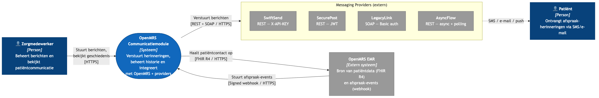

Het systeem heeft drie externe afhankelijkheden ([01-context.md](c4/01-context.md)):

1. **OpenMRS EMR** — leverancier van patiëntdata (FHIR R4) én bron van appointment-events (signed webhook).
2. **Messaging Providers** — vier providers met verschillende protocollen en authenticatie:
   - SwiftSend (REST, X-API-KEY, 10/min rate-limit)
   - SecurePost (REST, JWT met 3-min expiry, token-cache nodig)
   - LegacyLink (SOAP/XML, HTTP Basic, alleen SMS, per ontvanger)
   - AsyncFlow (REST, X-API-KEY, submit + poll-pattern)
3. **Zorgmedewerker** — verbindt via browser/HTTPS met de frontend.

De keuze om **vier heterogene providers** te ondersteunen via één uniforme interface dwingt een Strategy Pattern af in de backend (zie §6.2). Dat is geen toeval — het Avans-praktijklab levert deze providers als FakeComWorld bewust met verschillende contracten om integratiekwaliteit te toetsen.

---

## 4. Containers (C4 Level 2)

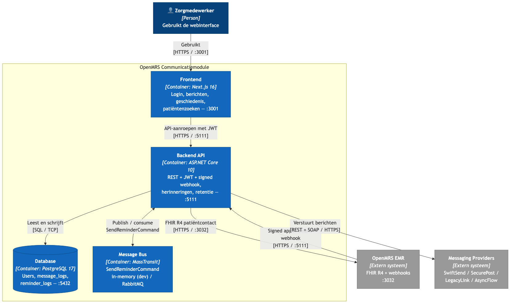

De module bestaat uit vier containers binnen één deployable systeem ([02-containers.md](c4/02-containers.md)):

| Container | Technologie | Verantwoordelijkheid | Poort |
|---|---|---|---|
| **Frontend** | Next.js 16 | Login, dashboard, berichten, geschiedenis, patiëntenzoeken | 3001 |
| **Backend API** | ASP.NET Core 10 | REST + JWT, signed webhook-endpoint, reminderscheduling, retentie | 5111 |
| **Database** | PostgreSQL 17 | Users, message_logs, reminder_logs, encrypted appointment-data | 5432 (intern) |
| **Message Bus** | MassTransit | `SendReminderCommand` — in-memory (dev) / RabbitMQ (prod) | 5672 (prod) |

**Waarom deze opdeling?**

- **Frontend ≠ backend**: het toestaan van onafhankelijke deploys van UI en API maakt iteratie sneller; Next.js levert SSR + rijke client-rendering uit dezelfde codebase ([ADR-0007](adr/0007-nextjs-for-frontend.md)).
- **Aparte message bus**: tijdgevoelige werken (reminders 5 minuten resolutie, dagelijkse retentie) mogen het HTTP-request-cycle niet blokkeren ([ADR-0009](adr/0009-masstransit-for-async-messaging.md)).
- **PostgreSQL ipv SQL Server / MySQL**: open source, brede hosting, JSONB + degelijke transactions ([ADR-0004](adr/0004-use-postgresql.md)).

Een **expliciet niet-doel** is microservices: de module is zelfstandig deployable en multi-tenant via `organization_id`-headers, maar interne services lopen in één ASP.NET Core proces (zie §5).

---

## 5. Componenten (C4 Level 3)

De interne structuur van de backend volgt een **layered architectuur binnen één project** ([ADR-0011](adr/0011-layered-folder-structure.md)). De dependency-richting is `Api → Application → Domain`, met `Infrastructure` die interfaces uit `Application` implementeert.

### 5.1 Synchrone request-flow

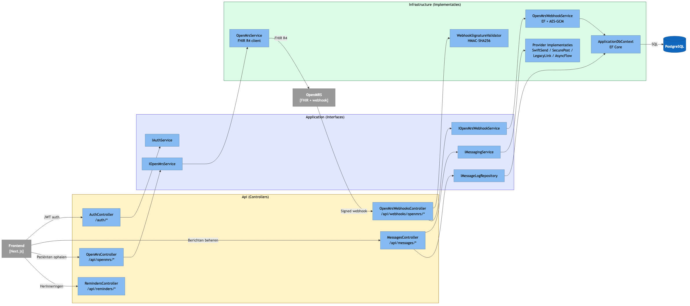

Inkomende HTTP-verkeer ([03-components.md](c4/03-components.md) sectie 3a):

| Controller | Route | Service | Implementatie |
|---|---|---|---|
| AuthController | `/auth/*` | `IAuthService` | ASP.NET Core Identity ([ADR-0003](adr/0003-use-identity-framework-for-auth.md)) |
| MessagesController | `/api/messages/*` | `IMessagingService` + `IMessageLogRepository` | Strategy: vier providers (§6.2) |
| OpenMrsController | `/api/openmrs/*` | `IOpenMrsService` | FHIR R4 client |
| OpenMrsWebhooksController | `/api/webhooks/openmrs/*` | `WebhookSignatureValidator` + `IOpenMrsWebhookService` | HMAC + EF + AES-GCM ([ADR-0012](adr/0012-signed-openmrs-webhook-contract.md)) |
| RemindersController | `/api/reminders/*` | `ReminderWorker.ProcessAsync()` | Handmatige trigger (UC10) |

De **kritieke observatie** is dat de webhookcontroller eerst signatuurvalidatie doet *vóór* hij ook maar één byte van de payload aan business-code geeft. Dit is een bewuste defense-in-depth keuze: een ongeldige HMAC raakt nooit de DB.

### 5.2 Asynchrone background-flow

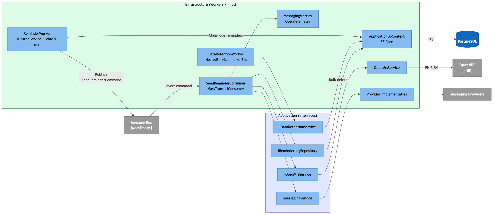

Workers en consumers ([03-components.md](c4/03-components.md) sectie 3b):

| Component | Type | Frequentie | Doel |
|---|---|---|---|
| `ReminderWorker` | `IHostedService` | elke 5 min | Claimt due reminders, publiceert `SendReminderCommand` |
| `SendReminderConsumer` | `IConsumer<SendReminderCommand>` | event-driven | Haalt patiëntcontact op, verstuurt via provider, logt |
| `DataRetentionWorker` | `IHostedService` | elke 24 uur | Verwijdert verlopen data conform §9 retentiebeleid |
| `MessagingMetrics` | OpenTelemetry | continu | Telemetry naar Prometheus `/metrics` |

**Waarom worker + consumer in plaats van direct verzenden vanuit de webhook?** Drie redenen:
1. **Idempotency** — de consumer doet `AlreadySentAsync(encounterId, window)` zodat dubbele webhook-events nooit dubbele berichten produceren.
2. **Retries** — MassTransit retried 3× met backoff voordat het naar een dead-letter queue gaat; iets wat in-controller-code lastig is.
3. **Schedulebaarheid** — een afspraak op donderdag om 14:00 moet een 24h-reminder op woensdag 14:00 krijgen. De webhook landt nu, niet morgen.

---

## 6. Domeinmodel en dataopslag

### 6.1 Domeinentiteiten

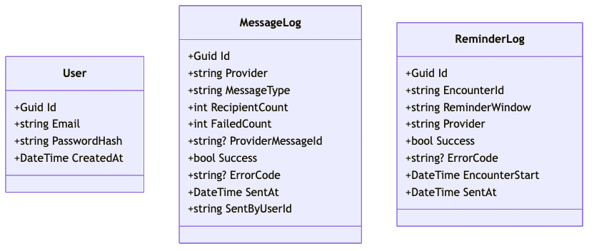

Drie kern-entities ([05-class-diagram.md](c4/05-class-diagram.md)):

- **User** — identiteit van een zorgmedewerker. E-mail is AES-256-GCM versleuteld; `email_hash` (HMAC-SHA256) is de deterministische lookup-kolom voor login en uniciteitscheck.
- **MessageLog** — audit-record per uitgaand bericht: provider, type, success, recipient_count. Geen PII. Retentie 365 dagen.
- **ReminderLog** — audit-record per herinnering. `encounter_id` is versleuteld; `encounter_id_hash` ondersteunt de idempotency-check. Retentie 14 dagen (bevat patiëntcontext).

### 6.2 Messaging providers — Strategy Pattern

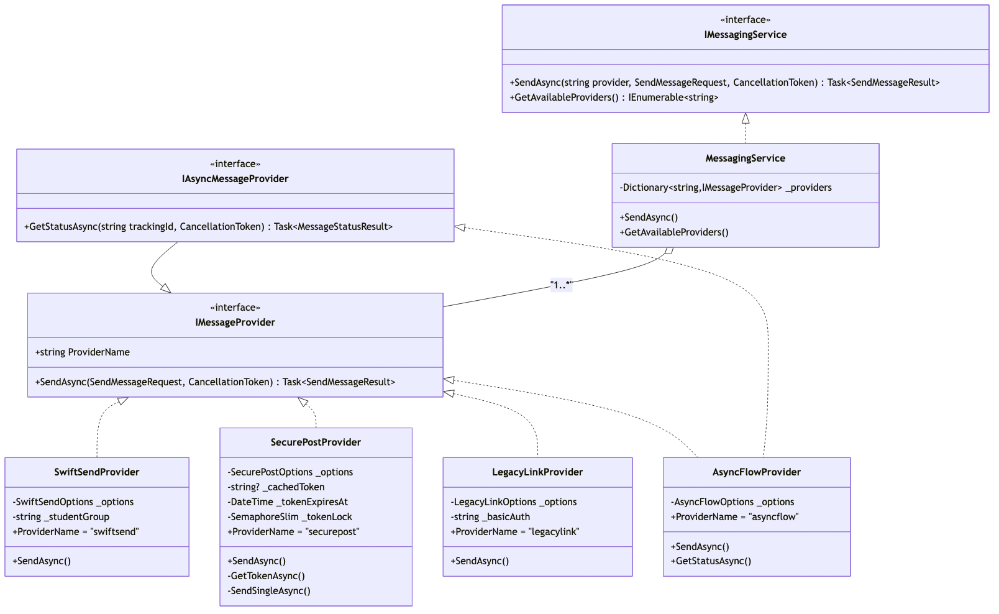

```
IMessageProvider (interface)
 ├── SwiftSendProvider     (X-API-KEY)
 ├── SecurePostProvider    (JWT met token-cache + SemaphoreSlim)
 ├── LegacyLinkProvider    (SOAP/Basic, SMS only)
 └── AsyncFlowProvider     (X-API-KEY, implementeert óók IAsyncMessageProvider)
```

`MessagingService` houdt een `Dictionary<string, IMessageProvider>` en dispatcht op providernaam. **Voordeel:** nieuwe provider toevoegen is één klasse + één DI-registratie; geen wijziging aan controllers, services of consumers. **Beperking:** providers met semantisch verschillend gedrag (zoals AsyncFlow's polling) breken de illusie van uniformiteit — daarom is `IAsyncMessageProvider` een aparte sub-interface.

### 6.3 OpenMRS-integratie

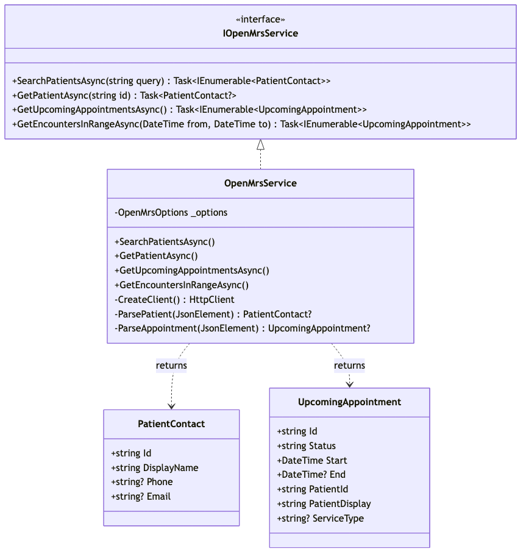

`OpenMrsService` implementeert `IOpenMrsService` en spreekt FHIR R4 over HTTPS. De service geeft `PatientContact` en `UpcomingAppointment` records terug — bewust *niet* de ruwe FHIR-resources. Dit isoleert het domein van wijzigingen in OpenMRS' resource-shape.

### 6.4 Background services

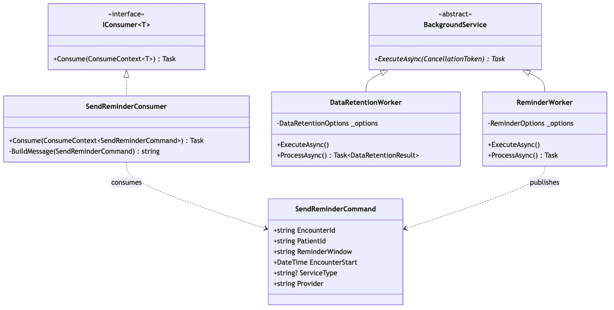

`ReminderWorker` en `DataRetentionWorker` erven van `BackgroundService`. `SendReminderConsumer` implementeert `IConsumer<SendReminderCommand>`. Het `SendReminderCommand` record is het contract op de bus — bewust een kleine, immutable POCO zodat consumers eenvoudig schalen.

### 6.5 Database schema

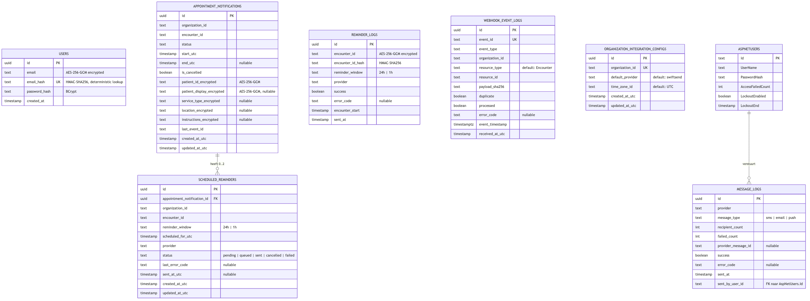

Het schema in zeven tabellen ([08-er-diagram.md](c4/08-er-diagram.md)):

| Tabel | Doel | Encryptie | Retentie |
|---|---|---|---|
| `users` | Identity (login) | `email` AES-GCM + `email_hash` HMAC | onbeperkt |
| `appointment_notifications` | Afspraakcontext uit webhook | 5 PII-velden AES-GCM | 14 dagen |
| `scheduled_reminders` | Geplande 24h/1h reminders | — (alleen FK + status) | volgt parent (cascade) |
| `reminder_logs` | Audit per herinnering | `encounter_id` AES-GCM | 14 dagen |
| `message_logs` | Audit ad-hoc berichten | — (meta only) | 365 dagen |
| `webhook_event_logs` | Webhook idempotency + audit | — (alleen hash + meta) | 365 dagen |
| `organization_integration_configs` | Per-org default provider, tijdzone | — | onbeperkt |

**Twee design-choices verdienen toelichting:**

1. **Encrypted + hash kolommen naast elkaar.** AES-GCM is non-deterministisch (verschillende ciphertext per keer), dus indexeerbaar is het niet. Voor velden waar we *op moeten zoeken* (login, idempotency) staat naast de encrypted kolom een HMAC-hash met een unieke / compound index. Dit is een bekend patroon bij field-level encryption.
2. **Geen FK van `message_logs.sent_by_user_id` naar `AspNetUsers.Id`.** Bewust losse koppeling: users kunnen verwijderd worden, maar audit-logs moeten 365 dagen overleven.

---

## 7. Belangrijkste procesflows

### 7.1 Automatische herinnerings-flow

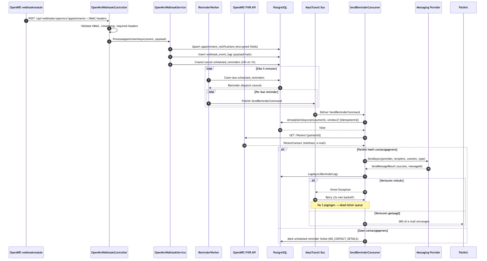

De volledige keten van webhook tot patiënt ([04-reminder-process.md](c4/04-reminder-process.md)):

1. **OpenMRS** stuurt `POST /api/webhooks/openmrs/appointments` met HMAC headers.
2. **Controller** valideert HMAC, timestamp (±5 min) en headers; weigert dubbele `event_id`.
3. **WebhookService** upsert `appointment_notifications` (encrypted), logt `webhook_event_logs`, creëert/cancelt twee `scheduled_reminders` (24h en 1h vooraf).
4. **ReminderWorker** claimt elke 5 minuten due reminders en publiceert per stuk een `SendReminderCommand`.
5. **SendReminderConsumer** doet idempotency-check, haalt patiëntcontact via FHIR, verstuurt via provider, logt `reminder_logs`.
6. **Bij fail**: 3× retry met backoff → DLQ; **bij geen contactgegevens**: reminder → `failed (NO_CONTACT_DETAILS)`.

De keuze om reminders **in twee stappen** te verwerken (plannen + verzenden) ipv direct uit de webhook, geeft:
- correcte planning (24h vooraf ≠ 24h vanaf nu);
- idempotency op DB-niveau (`scheduled_reminders` is bron van waarheid, niet de bus);
- ruimte voor retries en dead-lettering.

### 7.2 Handmatige trigger (test/debug)

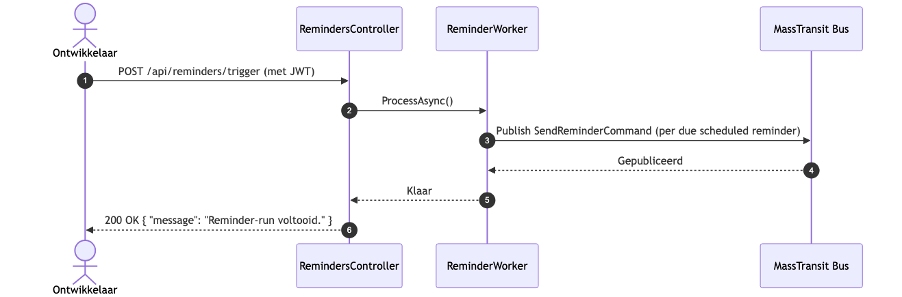

`POST /api/reminders/trigger` (met JWT) roept `ReminderWorker.ProcessAsync()` synchroon aan. Bedoeld voor ontwikkelaars die niet 5 minuten willen wachten tijdens debuggen. **Niet** voor productie-gebruik.

### 7.3 Data-retentie

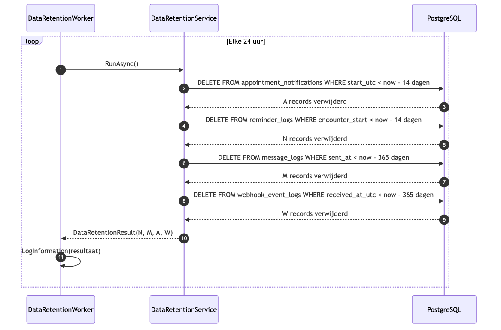

Elke 24 uur draait `DataRetentionWorker.RunAsync()` vier `DELETE` statements:

- `appointment_notifications` ouder dan 14 dagen
- `reminder_logs` ouder dan 14 dagen
- `message_logs` ouder dan 365 dagen
- `webhook_event_logs` ouder dan 365 dagen

Resultaat wordt gelogd; geen dry-run-mode (bewust — retentie is wet, niet optioneel).

### 7.4 User flow — zorgmedewerker

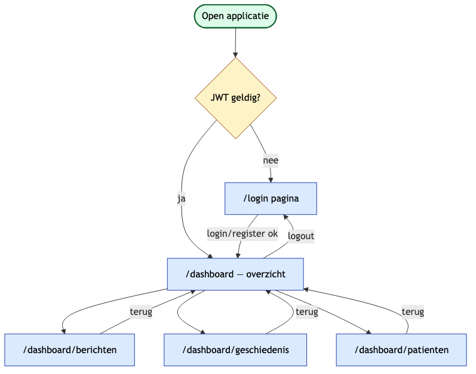

De vier hoofdtaken in de frontend ([07-user-flow.md](c4/07-user-flow.md)):

| Flow | Schermen | API-calls |
|---|---|---|
| **Login / register** | `/login` → `/dashboard` | `POST /auth/register`, `POST /auth/login` |
| **Bericht versturen** | `/dashboard/berichten` | `GET /api/messages/providers` → `POST /api/messages` |
| **Patiënt zoeken** | `/dashboard/patienten` | `GET /api/openmrs/patients?q=` → `GET /api/openmrs/patients/{id}` → `GET /api/openmrs/appointments` |
| **Geschiedenis** | `/dashboard/geschiedenis` | `GET /api/messages/history` (+ optioneel `GET /api/messages/status/{trackingId}` voor AsyncFlow) |

Rate-limiting bewaakt twee endpoints: 5/min op `/auth/login` (NIST best-practice), 10/min op `/api/messages` (gelijk aan SwiftSend's eigen quota).

---

## 8. Architectuurbeslissingen — samenvatting

De **vijftien ADR's** vormen samen het hart van dit verslag. Hier is de groepering per thema (volledige beslissingen: [adr/](adr/)).

### 8.1 Procesafspraken
- **[ADR-0001](adr/0001-record-architecture-decisions.md)** — elke significante keuze krijgt een ADR (Context → Decision → Consequences).
- **[ADR-0011](adr/0011-layered-folder-structure.md)** — layered mappenstructuur binnen één `.csproj`. Compiler dwingt richting niet af; reviewers wel.
- **[ADR-0014](adr/0014-ci-quality-gates.md)** — drie repos, drie GitHub Actions: backend (build + xUnit + Docker + secret scan), frontend (lint + Vitest + Next build + Playwright), OpenMRS-module (Maven + distro check). PR's falen vroeg.

### 8.2 Stack-keuzes
- **[ADR-0002](adr/0002-use-dapper-as-orm.md)** — Dapper voor domein-queries (geen N+1 verrassingen). EF Core enkel voor Identity.
- **[ADR-0003](adr/0003-use-identity-framework-for-auth.md)** — ASP.NET Core Identity met `MapIdentityApi<IdentityUser>()`. Geen handgeschreven AuthController.
- **[ADR-0004](adr/0004-use-postgresql.md)** — PostgreSQL 17. Provider Npgsql voor zowel EF Core als Dapper.
- **[ADR-0007](adr/0007-nextjs-for-frontend.md)** — Next.js 16 frontend (rijp ecosysteem, breed inzetbaar).
- **[ADR-0009](adr/0009-masstransit-for-async-messaging.md)** — MassTransit als message bus. In-memory dev, RabbitMQ prod.

### 8.3 Integratie & security
- **[ADR-0005](adr/0005-use-docker-for-deployment.md)** — multi-stage Dockerfile + `docker-compose.yml`. Eén commando voor de hele stack.
- **[ADR-0006](adr/0006-secrets-via-env-file.md)** — geen credentials in git. `.env` lokaal (uit OneDrive), secrets-store in prod.
- **[ADR-0008](adr/0008-webhook-for-openmrs-integration.md)** — webhooks i.p.v. polling. Event-driven, real-time, lagere load.
- **[ADR-0012](adr/0012-signed-openmrs-webhook-contract.md)** — gedeeld webhook-secret + HMAC-SHA256 over `timestamp + "." + body` + idempotency op `event_id`.
- **[ADR-0010](adr/0010-data-retention-and-encryption-policy.md)** — drie-tier retentiebeleid (actief, completed-de-identified, deleted) + AES-256 voor PII.
- **[ADR-0015](adr/0015-encryption-and-webhook-security-posture.md)** — AES-256-GCM via `Security:EncryptionKey` (`SECURITY_ENCRYPTION_KEY` env-var). Geen raw payload in DB; logs zonder PII.

### 8.4 Test- en kwaliteitsstrategie
- **[ADR-0013](adr/0013-pragmatic-automated-test-strategy.md)** — testpiramide: backend xUnit (HMAC, encryptie, idempotency), frontend Vitest + Playwright smoke, OpenMRS-module Maven/JUnit. Volledige containervalidatie blijft handmatig — bewuste keuze voor PR-snelheid.

---

## 9. Kwaliteitsattributen (NFR's)

De niet-functionele eisen uit [requirements.md](requirements.md) en hun architectuurkoppeling:

| NFR | Eis | Architectuurmiddel |
|---|---|---|
| **NFE-1** | Zelfstandig SaaS, multi-tenant | Module draait standalone; `organization_id` in webhookheaders en `organization_integration_configs` |
| **NFE-2** | Gedocumenteerde en beveiligde OpenMRS-integratie | Signed webhook ([ADR-0012](adr/0012-signed-openmrs-webhook-contract.md)) + [webhook-openmrs-backend.md](webhook-openmrs-backend.md) |
| **NFE-3** | Vier providers | Strategy Pattern (§6.2) |
| **NFE-4** | OpenMRS 2.7.x+ | LU1 distro = OpenMRS 2.8.6 |
| **NFE-5** | AES-256 + geen secrets in code | AES-256-GCM ([ADR-0015](adr/0015-encryption-and-webhook-security-posture.md)); `.env` gitignored ([ADR-0006](adr/0006-secrets-via-env-file.md)) |
| **NFE-6** | HL7/FHIR | FHIR R4 client in `OpenMrsService` |
| **NFE-7** | Retry / fallback / queueing | MassTransit retry + DLQ; OpenMRS outbox voor webhookfailures |
| **NFE-8** | UTF-8 karaktersets | Provider-adapters gebruiken UTF-8 in JSON/XML |
| **NFE-9** | Observability | OpenTelemetry + Prometheus `/metrics` |
| **NFE-10** | Patiëntdata weg binnen 14 dagen | `DataRetentionWorker` (§7.3) |
| **NFE-11** | Metadata ≤ 1 jaar | `message_logs`, `webhook_event_logs` retentie 365 dagen |
| **NFE-12** | Uitbreidbaar naar andere modules | Webhookcontract ondersteunt nieuwe `resource_type` waarden |
| **NFE-13** | Tijdzones | Alles UTC; org-tijdzone in `organization_integration_configs.time_zone_id` |

**Trade-offs die we expliciet hebben geaccepteerd:**

- **Twee ORM's naast elkaar.** EF (Identity) + Dapper (domein) verhoogt cognitive load voor nieuwe devs. Geaccepteerd omdat de domein-queries simpel zijn en N+1-risico's tellen ([ADR-0002](adr/0002-use-dapper-as-orm.md)).
- **Layered folders in plaats van Clean Architecture met aparte projecten.** Geen compiler-enforcement van dependency-richting. Geaccepteerd voor projectomvang; refactor naar aparte projecten kan later zonder herschrijven ([ADR-0011](adr/0011-layered-folder-structure.md)).
- **In-memory MassTransit voor dev.** Niet representatief voor productie failure-modes. Geaccepteerd omdat RabbitMQ-setup lokaal te zwaar is voor elke developer ([ADR-0009](adr/0009-masstransit-for-async-messaging.md)).
- **Full OpenMRS container niet in PR-CI.** Te traag en te flaky. Vervangen door unit tests op de webhook-contracten en handmatige acceptatietests ([ADR-0013](adr/0013-pragmatic-automated-test-strategy.md)).

---

## 10. Deployment

### 10.1 Lokale ontwikkelomgeving

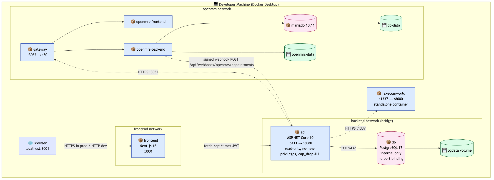

Drie compose-projecten op één developer-machine ([09-deployment.md](c4/09-deployment.md)):

1. **FakeComWorld** standalone (`:1337`) — simuleert de vier messaging-providers.
2. **OpenMRS distro** — gateway (`:3032`) + frontend + backend + mariadb.
3. **OpenMRSmoduleBackend** — eigen `api` + Postgres + frontend op `:3001`.

`start.sh` orkestreert de opstartvolgorde en sourcet credentials uit één `.env` zodat er geen drift is tussen services.

**Container-hardening op de API** (gelijk aan productie): `read_only: true`, `cap_drop: ALL`, `no-new-privileges:true`, tmpfs `/tmp`, port-binding `127.0.0.1:5111` (niet `0.0.0.0`).

### 10.2 Productie-target

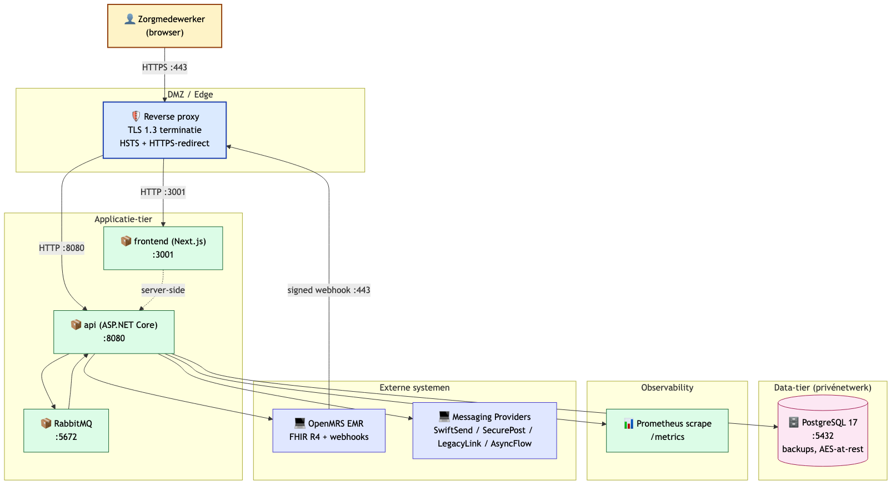

Drielagig:

- **DMZ:** reverse proxy met TLS 1.3-terminatie, HSTS, HTTPS-redirect.
- **App-tier:** frontend pod, API pod, RabbitMQ pod. Geen directe internet-toegang behalve via de proxy.
- **Data-tier (privé):** PostgreSQL met AES-at-rest en backups. Geen public port.
- **Observability:** Prometheus scrape op `/metrics` via OpenTelemetry.
- **Externe afhankelijkheden:** OpenMRS EMR (FHIR R4 + webhook) en de vier messaging-providers buiten het cluster.

Belangrijke productie-eisen die in dev al worden gespiegeld:

| Maatregel | Implementatie |
|---|---|
| TLS 1.3 | Reverse proxy + `UseHsts()` + `UseHttpsRedirection()` |
| DB-isolatie | PostgreSQL geen public port, alleen backend-netwerk |
| Container-hardening | read-only fs, cap_drop ALL, no-new-privileges |
| Secrets | Geen `.env` in prod — Azure Key Vault / Kubernetes secrets |
| CORS | Whitelist via `ALLOWED_ORIGINS`, geen wildcard |
| Rate limiting | 5/min auth, 10/min messaging, 100/min global |
| AES-256-GCM | PII at rest in PostgreSQL |

---

## 11. Risico's en vervolgstappen

| Risico | Impact | Beheersing |
|---|---|---|
| Layered structuur zonder compiler-enforcement leidt op termijn tot leakage van `Infrastructure` in `Api`. | Code-rot, lastige refactor later. | Reviewchecklist + grep-based CI-check; splitsing naar aparte `.csproj`'s wanneer team groeit ([ADR-0011](adr/0011-layered-folder-structure.md)). |
| Encryptiesleutel-rotatie is nog handmatig. | Verloren toegang tot oude data bij key-wissel. | Toekomstige ADR voor key-versioning (genoemd in [ADR-0015](adr/0015-encryption-and-webhook-security-posture.md)). |
| In-memory MassTransit dev wijkt af van RabbitMQ prod. | Bugs die alleen in prod opduiken (message-ordering, persistence). | Smoke tests met RabbitMQ in staging voordat een release naar prod gaat. |
| OpenMRS-integratie wordt niet in PR-CI gevalideerd. | Breaking changes in OpenMRS resource-shape worden laat ontdekt. | Wekelijkse handmatige acceptatietest tegen de full distro. |
| Geen formele key-management / HSM in productie. | Bij host-compromise is `SECURITY_ENCRYPTION_KEY` te lezen. | Migratie naar Azure Key Vault / AWS KMS als onderdeel van eerste prod-deploy. |

---

## 12. Conclusie

De architectuur volgt drie kerngedachten:

1. **Eén deployable, meerdere zorgvuldig gescheiden lagen.** De layered structuur ([ADR-0011](adr/0011-layered-folder-structure.md)) houdt complexiteit beheersbaar zonder vroege over-engineering richting microservices.
2. **Event-driven waar latency telt, synchroon waar UX telt.** Reminders lopen async via MassTransit ([ADR-0009](adr/0009-masstransit-for-async-messaging.md)); de zorgmedewerker krijgt direct response in de UI.
3. **Security en privacy zijn standaard.** AES-256-GCM + HMAC-deterministic lookup ([ADR-0015](adr/0015-encryption-and-webhook-security-posture.md)), signed webhooks ([ADR-0012](adr/0012-signed-openmrs-webhook-contract.md)), data-retentie via worker ([ADR-0010](adr/0010-data-retention-and-encryption-policy.md)), en geen secrets in git ([ADR-0006](adr/0006-secrets-via-env-file.md)).

Volledige diagrammen: [c4/](c4/). Volledige beslissingen: [adr/](adr/).
