# C4 Level 1 - System Context

The OpenMRS Communication Module is now backend-only. OpenMRS O3 is the clinical user interface; the backend exposes APIs, signed webhooks, reminder scheduling, and provider integration.

```mermaid
flowchart LR
    classDef person fill:#08427b,stroke:#073b6f,color:#fff
    classDef system fill:#1168bd,stroke:#0b4884,color:#fff
    classDef ext fill:#767676,stroke:#525252,color:#fff

    clinician["Clinician<br/>Uses OpenMRS O3"]:::person
    patient["Patient<br/>Receives SMS/email reminders"]:::person
    openmrs["OpenMRS O3<br/>EMR UI, FHIR R4 API, signed appointment events"]:::ext
    backend(["OpenMRS Communication Backend<br/>ASP.NET Core API, auth, webhook processing, reminder scheduling"]):::system
    providers["Messaging providers<br/>SwiftSend, SecurePost, LegacyLink, AsyncFlow"]:::ext

    clinician -->|"Clinical workflow"| openmrs
    openmrs -->|"Signed appointment webhook"| backend
    backend -->|"FHIR patient/contact lookup"| openmrs
    backend -->|"Selected provider only; no auto fallback"| providers
    providers -->|"SMS/email delivery"| patient
```

