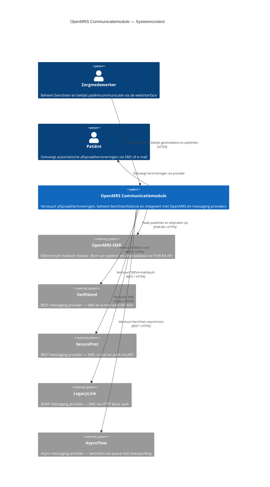

# C4 Level 1 — System Context

Wie gebruikt het systeem en met welke externe systemen communiceert het?

```mermaid
C4Context
    title OpenMRS Communicatiemodule — Systeemcontext

    Person(zorgmedewerker, "Zorgmedewerker", "Beheert berichten en bekijkt patiëntcommunicatie via de webinterface")
    Person(patient, "Patiënt", "Ontvangt automatische afspraakherinneringen via SMS of e-mail")

    System(module, "OpenMRS Communicatiemodule", "Verstuurt afspraakherinneringen, beheert berichtenhistorie en integreert met OpenMRS en messaging providers")

    System_Ext(openmrs, "OpenMRS EMR", "Elektronisch medisch dossier. Bron van patiënt- en afspraakdata via FHIR R4 API")

    System_Ext(swiftsend, "SwiftSend", "REST messaging provider — SMS en e-mail via X-API-KEY")
    System_Ext(securepost, "SecurePost", "REST messaging provider — SMS, e-mail en push via JWT")
    System_Ext(legacylink, "LegacyLink", "SOAP messaging provider — SMS via HTTP Basic auth")
    System_Ext(asyncflow, "AsyncFlow", "Async messaging provider — berichten via queue met statuspolling")

    Rel(zorgmedewerker, module, "Stuurt berichten, bekijkt geschiedenis en patiënten", "HTTPS")
    Rel(module, openmrs, "Haalt patiënten en afspraken op", "FHIR R4 / HTTPS")
    Rel(module, swiftsend, "Verstuurt SMS/e-mail", "REST / HTTPS")
    Rel(module, securepost, "Verstuurt SMS/e-mail/push", "REST / HTTPS")
    Rel(module, legacylink, "Verstuurt SMS", "SOAP / HTTPS")
    Rel(module, asyncflow, "Verstuurt berichten asynchroon", "REST / HTTPS")
    Rel_Back(patient, module, "Ontvangt herinneringen via provider")
```
