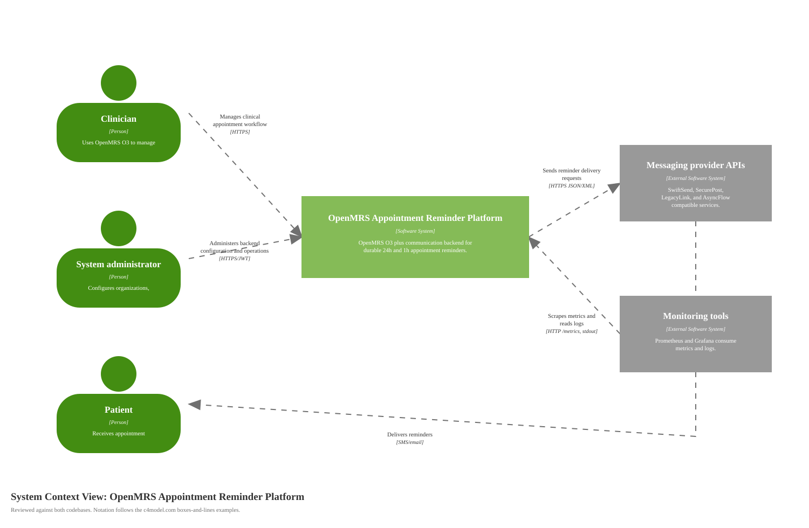

# System Context Diagram for OpenMRS Appointment Reminder Platform

Source: [diagrams/01-context.svg](diagrams/01-context.svg), generated by [generate-c4-diagrams.mjs](generate-c4-diagrams.mjs)

## Scope

One software system: the OpenMRS Appointment Reminder Platform. This includes the OpenMRS O3 distro, the custom OpenMRS appointment webhook module, and the ASP.NET Core communication backend.

## Primary Element

| Element | Type | Description |
|---|---|---|
| OpenMRS Appointment Reminder Platform | Software System | Turns appointment changes in OpenMRS O3 into durable 24-hour and 1-hour reminders sent through configured messaging providers. |

## Supporting Elements

| Element | Type | Description |
|---|---|---|
| Clinician | Person | Uses OpenMRS O3 for clinical appointment workflows. |
| Patient | Person | Receives appointment reminders by SMS or email. |
| System administrator | Person | Configures backend access, organizations, providers, templates, and retry operations. |
| Messaging provider APIs | External Software System | FakeComWorld-compatible provider APIs: SwiftSend, SecurePost, LegacyLink, and AsyncFlow. |
| Monitoring tools | External Software System | Prometheus/Grafana or equivalent tools that scrape metrics and read logs. |

## Diagram Key

| Notation | Meaning |
|---|---|
| Person | Human actor or role. |
| Software System | The system being described at context level. |
| External Software System | System outside this platform boundary. |
| Solid arrow | One-way relationship. The arrow label states the intent and protocol where useful. |
| Logos/icons | None used. All semantics are expressed by C4 element type, name, technology, and description. |
