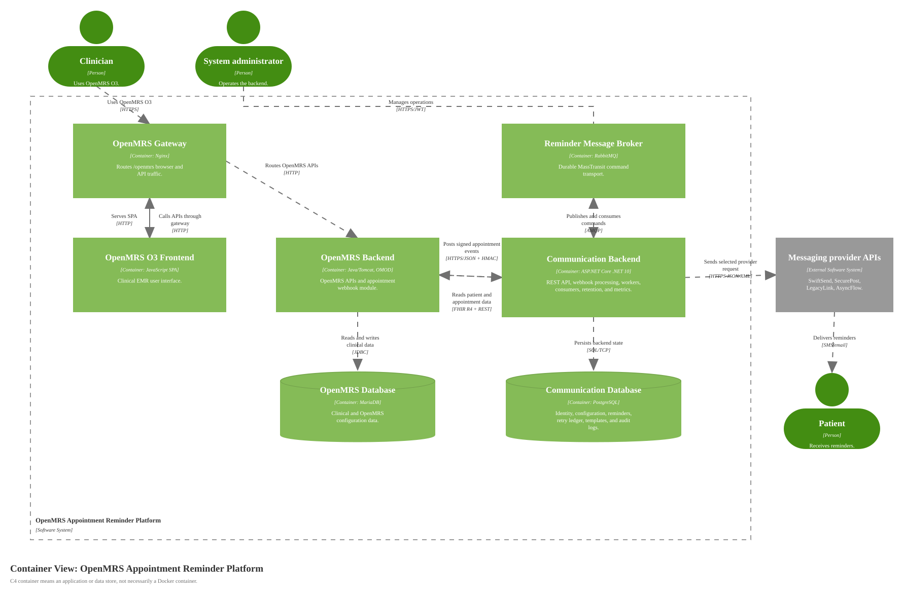

# Container Diagram for OpenMRS Appointment Reminder Platform

Source: [diagrams/02-containers.svg](diagrams/02-containers.svg), generated by [generate-c4-diagrams.mjs](generate-c4-diagrams.mjs)

## Scope

One software system: the OpenMRS Appointment Reminder Platform.

## Containers

| Container | Technology | Responsibility |
|---|---|---|
| OpenMRS Gateway | Nginx, Docker | Routes `/openmrs` browser and API traffic to OpenMRS O3 frontend/backend containers. |
| OpenMRS O3 Frontend | OpenMRS SPA, JavaScript, Docker | Provides the clinical EMR user interface. |
| OpenMRS Backend | OpenMRS 2.8.6, Java/Tomcat, custom OMOD | Hosts OpenMRS REST/FHIR APIs and emits signed appointment events through the custom webhook module. |
| OpenMRS Database | MariaDB 10.11 | Stores OpenMRS clinical and configuration data. |
| Communication Backend API and Workers | ASP.NET Core .NET 10, EF Core, MassTransit | Exposes REST endpoints, validates webhooks, schedules reminders, dispatches work, sends provider messages, applies retention, and publishes metrics. |
| Communication Database | PostgreSQL 17 | Stores identity data, hospital configuration, provider configuration, appointment state, scheduled reminders, retry ledger fields, message templates, and audit logs. |
| Reminder Message Broker | RabbitMQ 4.1 via MassTransit | Durably transports reminder delivery commands outside integration tests. |

## External Elements

| Element | Type | Description |
|---|---|---|
| Clinician | Person | Uses the OpenMRS O3 clinical UI. |
| Patient | Person | Receives reminders from providers. |
| System administrator | Person | Operates and configures the backend. |
| Messaging provider APIs | External Software System | SwiftSend, SecurePost, LegacyLink, and AsyncFlow compatible endpoints. |
| Monitoring stack | External Software System | Prometheus/Grafana or equivalent monitoring. |

## Diagram Key

| Notation | Meaning |
|---|---|
| Container | Separately runnable application/process inside the platform. |
| Database | Data store owned by one of the platform containers. |
| Queue | Durable message transport. |
| External Software System | System outside this platform boundary. |
| Solid arrow | One-way relationship. Container relationships include protocol or technology labels. |
| Logos/icons | None used. Shape and C4 element type carry the notation. |
