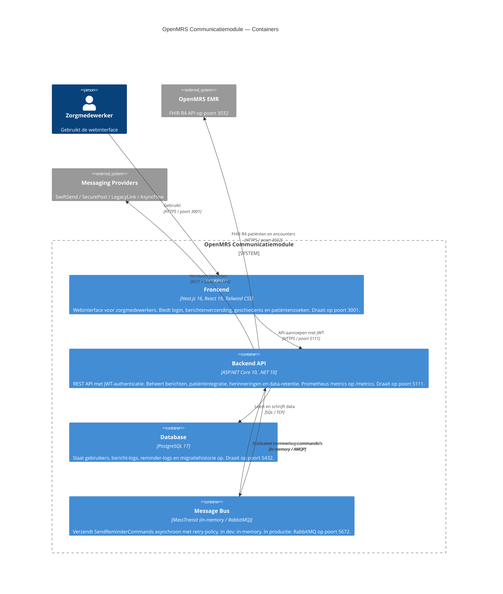

# C4 Level 2 — Containers

De technische bouwstenen van de OpenMRS Communicatiemodule.

```mermaid
C4Container
    title OpenMRS Communicatiemodule — Containers

    Person(zorgmedewerker, "Zorgmedewerker", "Gebruikt de webinterface")

    System_Ext(openmrs, "OpenMRS EMR", "FHIR R4 API op poort 3032")
    System_Ext(providers, "Messaging Providers", "SwiftSend / SecurePost / LegacyLink / AsyncFlow")

    System_Boundary(module, "OpenMRS Communicatiemodule") {
        Container(frontend, "Frontend", "Next.js 16, React 19, Tailwind CSS", "Webinterface voor zorgmedewerkers. Biedt login, berichtenverzending, geschiedenis en patiëntenzoeken. Draait op poort 3001.")

        Container(api, "Backend API", "ASP.NET Core 10, .NET 10", "REST API met JWT-authenticatie. Beheert berichten, patiëntintegratie, herinneringen en data-retentie. Prometheus metrics op /metrics. Draait op poort 5111.")

        Container(db, "Database", "PostgreSQL 17", "Slaat gebruikers, bericht-logs, reminder-logs en migratiehistorie op. Draait op poort 5432.")

        Container(bus, "Message Bus", "MassTransit (in-memory / RabbitMQ)", "Verzendt SendReminderCommands asynchroon met retry-policy. In dev: in-memory. In productie: RabbitMQ op poort 5672.")
    }

    Rel(zorgmedewerker, frontend, "Gebruikt", "HTTPS / poort 3001")
    Rel(frontend, api, "API-aanroepen met JWT", "HTTPS / poort 5111")
    Rel(api, db, "Leest en schrijft data", "SQL / TCP")
    Rel(api, bus, "Publiceert herinneringscommando's", "In-memory / AMQP")
    Rel(bus, api, "Consumers verwerken commando's", "In-memory / AMQP")
    Rel(api, openmrs, "FHIR R4 patiënten en encounters", "HTTPS / poort 3032")
    Rel(api, providers, "Verstuurt berichten", "REST + SOAP / HTTPS")
```
