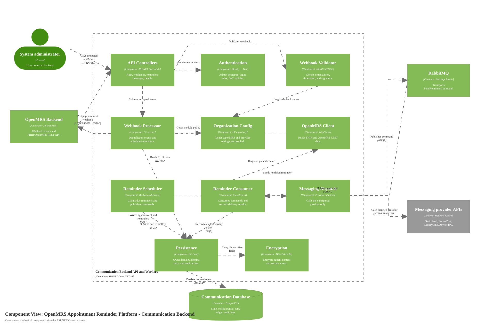

# Component Diagram for Communication Backend API and Workers

Source: [diagrams/03-backend-components.svg](diagrams/03-backend-components.svg), generated by [generate-c4-diagrams.mjs](generate-c4-diagrams.mjs)

## Scope

One container from the container diagram: **Communication Backend API and Workers**.

## Components

| Component | Technology | Responsibility |
|---|---|---|
| API Controllers | ASP.NET Core MVC controllers | Expose auth, OpenMRS proxy, webhook, messaging, reminder, retention, health, and demo endpoints. |
| Authentication and Authorization | ASP.NET Core Identity, JWT | Bootstraps admin access, validates login, issues JWTs, and applies role-based admin policy. |
| Webhook Signature Validator | C# service, HMAC-SHA256 | Validates organization id, timestamp skew, and signature over `timestamp + "." + raw_body`. |
| Appointment Webhook Processor | C# service, EF Core transaction | Deduplicates events, records webhook metadata, upserts appointment state, and creates/cancels scheduled reminders. |
| Organization Configuration | EF Core repository and startup seeder | Resolves per-organization OpenMRS credentials, webhook secrets, default provider, timezone, and retry policy. |
| OpenMRS Client | HttpClient, FHIR R4, OpenMRS REST | Reads patient contact and appointment/visit/reference data from the correct OpenMRS instance. |
| Reminder Scheduler Worker | .NET BackgroundService | Claims due reminders and publishes delivery commands to RabbitMQ through MassTransit. |
| Reminder Delivery Consumer | MassTransit consumer | Consumes reminder commands, performs FHIR lookup, sends reminders, and records delivery/retry state. |
| Messaging Dispatch | Provider registry and adapters | Sends through the configured provider only; no automatic provider fallback. |
| Persistence Repositories | EF Core DbContext and repositories | Owns PostgreSQL reads/writes for domain, retry, audit, and identity state. |
| Encryption Services | AES-256-GCM | Encrypts patient context and secrets before persistence. |
| Data Retention Worker | .NET BackgroundService | Enforces 14-day patient-data retention and 365-day metadata retention. |
| Observability Instrumentation | OpenTelemetry and Prometheus exporter | Emits traces and metrics without logging patient names, contacts, or message content. |

## Diagram Key

| Notation | Meaning |
|---|---|
| Component | Logical grouping of code inside the backend container. |
| Container/Database/Queue outside boundary | Elements from the parent container diagram that this container depends on. |
| External Software System | Provider APIs outside the platform boundary. |
| Solid arrow | One-way relationship. Labels state intent and protocol/technology when crossing a process boundary. |
| Logos/icons | None used. The C4 element type and descriptions carry the notation. |
