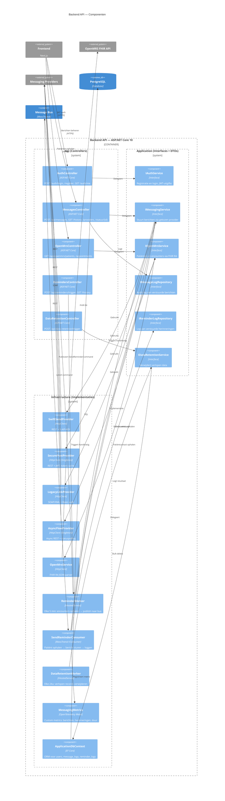

# C4 Level 3 — Componenten (Backend API)

Interne structuur van de ASP.NET Core backend, georganiseerd per architectuurlaag.

```mermaid
C4Component
    title Backend API — Componenten

    System_Ext(frontend, "Frontend", "Next.js")
    System_Ext(openmrs, "OpenMRS FHIR API")
    System_Ext(providers, "Messaging Providers")
    ContainerDb(db, "PostgreSQL", "Database")
    Container(bus, "Message Bus", "MassTransit")

    Container_Boundary(api, "Backend API — ASP.NET Core 10") {

        Boundary(api_layer, "Api (Controllers)") {
            Component(authCtrl, "AuthController", "ASP.NET Core", "POST /auth/login, /register, GET /auth/me")
            Component(msgCtrl, "MessagesController", "ASP.NET Core", "POST /api/messages, GET /history, /providers, /status/{id}")
            Component(openmrsCtrl, "OpenMrsController", "ASP.NET Core", "GET /api/openmrs/patients, /appointments")
            Component(reminderCtrl, "RemindersController", "ASP.NET Core", "POST /api/reminders/trigger, GET /history")
            Component(retentionCtrl, "DataRetentionController", "ASP.NET Core", "POST /api/data-retention/trigger")
        }

        Boundary(app_layer, "Application (Interfaces + DTOs)") {
            Component(authSvc, "IAuthService", "Interface", "Registratie en login, JWT-uitgifte")
            Component(msgSvc, "IMessagingService", "Interface", "Stuurt berichten via gekozen provider")
            Component(openMrsSvc, "IOpenMrsService", "Interface", "Patiënten en encounters via FHIR R4")
            Component(msgLog, "IMessageLogRepository", "Interface", "Audit-log van verstuurde berichten")
            Component(reminderLog, "IReminderLogRepository", "Interface", "Log van verstuurde herinneringen")
            Component(retentionSvc, "IDataRetentionService", "Interface", "Verwijdert verlopen data")
        }

        Boundary(infra_layer, "Infrastructure (Implementaties)") {
            Component(swiftsend, "SwiftSendProvider", "HttpClient", "REST + X-API-KEY")
            Component(securepost, "SecurePostProvider", "HttpClient (Singleton)", "REST + JWT, token-cache")
            Component(legacylink, "LegacyLinkProvider", "HttpClient", "SOAP/XML + Basic auth")
            Component(asyncflow, "AsyncFlowProvider", "HttpClient (Singleton)", "Async REST + statuspolling")
            Component(openMrsImpl, "OpenMrsService", "HttpClient", "FHIR R4 JSON parser")
            Component(reminderWorker, "ReminderWorker", "IHostedService", "Elke 5 min: encounters ophalen → publish naar bus")
            Component(consumer, "SendReminderConsumer", "MassTransit IConsumer", "Patiënt ophalen → bericht sturen → loggen")
            Component(retentionWorker, "DataRetentionWorker", "IHostedService", "Elke 24u: verlopen records verwijderen")
            Component(metrics, "MessagingMetrics", "OpenTelemetry Meter", "Custom metrics: berichten, herinneringen, duur")
            Component(efCtx, "ApplicationDbContext", "EF Core", "ORM voor users, message_logs, reminder_logs")
        }
    }

    Rel(frontend, authCtrl, "JWT auth", "HTTPS")
    Rel(frontend, msgCtrl, "Berichten beheren", "HTTPS")
    Rel(frontend, openmrsCtrl, "Patiënten ophalen", "HTTPS")

    Rel(authCtrl, authSvc, "Delegeert")
    Rel(msgCtrl, msgSvc, "Delegeert")
    Rel(msgCtrl, msgLog, "Logt")
    Rel(openmrsCtrl, openMrsSvc, "Delegeert")
    Rel(reminderCtrl, reminderWorker, "Triggert handmatig")
    Rel(retentionCtrl, retentionSvc, "Triggert handmatig")

    Rel(msgSvc, swiftsend, "Gebruikt")
    Rel(msgSvc, securepost, "Gebruikt")
    Rel(msgSvc, legacylink, "Gebruikt")
    Rel(msgSvc, asyncflow, "Gebruikt")
    Rel(openMrsSvc, openMrsImpl, "Implementatie")

    Rel(reminderWorker, openMrsSvc, "Encounters ophalen")
    Rel(reminderWorker, bus, "Publiceert SendReminderCommand")
    Rel(bus, consumer, "Levert command")
    Rel(consumer, openMrsSvc, "Patiëntcontact ophalen")
    Rel(consumer, msgSvc, "Bericht versturen")
    Rel(consumer, reminderLog, "Logt resultaat")
    Rel(consumer, metrics, "Registreert metric")

    Rel(retentionWorker, retentionSvc, "Delegeert")
    Rel(retentionSvc, efCtx, "Bulk delete")
    Rel(efCtx, db, "SQL")

    Rel(swiftsend, providers, "REST")
    Rel(securepost, providers, "REST")
    Rel(legacylink, providers, "SOAP")
    Rel(asyncflow, providers, "REST")
    Rel(openMrsImpl, openmrs, "FHIR R4")
```
