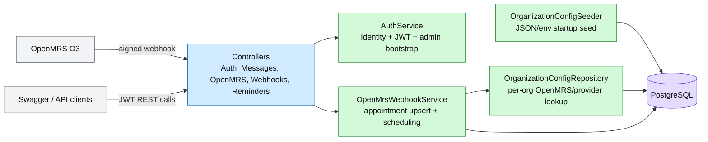
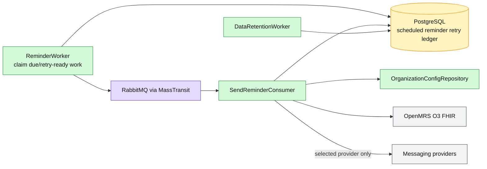

# C4 Level 3 - Backend Components

## Request And Configuration Components

```mermaid
flowchart LR
    classDef api fill:#d0ebff,stroke:#1971c2,color:#111
    classDef app fill:#fff3bf,stroke:#f08c00,color:#111
    classDef infra fill:#d3f9d8,stroke:#2b8a3e,color:#111
    classDef db fill:#e5dbff,stroke:#5f3dc4,color:#111
    classDef ext fill:#f1f3f5,stroke:#495057,color:#111

    openmrs["OpenMRS O3"]:::ext
    clients["Swagger / API clients"]:::ext
    controllers["Controllers<br/>Auth, Messages, OpenMRS, Webhooks, Reminders"]:::api
    auth["AuthService<br/>Identity + JWT + admin bootstrap"]:::infra
    webhook["OpenMrsWebhookService<br/>appointment upsert + scheduling"]:::infra
    orgrepo["OrganizationConfigRepository<br/>per-org OpenMRS/provider lookup"]:::infra
    seeder["OrganizationConfigSeeder<br/>JSON/env startup seed"]:::infra
    pg[("PostgreSQL")]:::db

    openmrs -->|"signed webhook"| controllers
    clients -->|"JWT REST calls"| controllers
    controllers --> auth
    controllers --> webhook
    webhook --> orgrepo
    seeder --> pg
    orgrepo --> pg
    webhook --> pg
```

## Background Delivery Components

```mermaid
flowchart LR
    classDef api fill:#d0ebff,stroke:#1971c2,color:#111
    classDef infra fill:#d3f9d8,stroke:#2b8a3e,color:#111
    classDef queue fill:#e5dbff,stroke:#5f3dc4,color:#111
    classDef db fill:#fff3bf,stroke:#f08c00,color:#111
    classDef ext fill:#f1f3f5,stroke:#495057,color:#111

    pg[("PostgreSQL<br/>scheduled reminder retry ledger")]:::db
    worker["ReminderWorker<br/>claim due/retry-ready work"]:::infra
    rabbit["RabbitMQ via MassTransit"]:::queue
    consumer["SendReminderConsumer"]:::infra
    orgrepo["OrganizationConfigRepository"]:::infra
    openmrs["OpenMRS O3 FHIR"]:::ext
    providers["Messaging providers"]:::ext
    retention["DataRetentionWorker"]:::infra

    worker --> pg
    worker --> rabbit
    rabbit --> consumer
    consumer --> orgrepo
    consumer --> openmrs
    consumer -->|"selected provider only"| providers
    consumer --> pg
    retention --> pg
```
