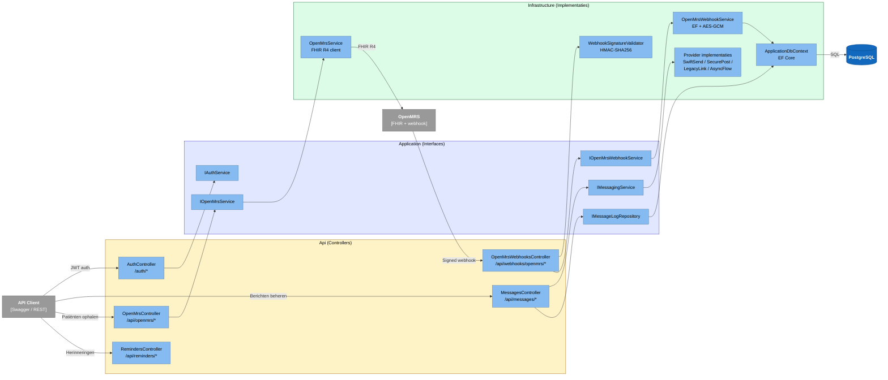
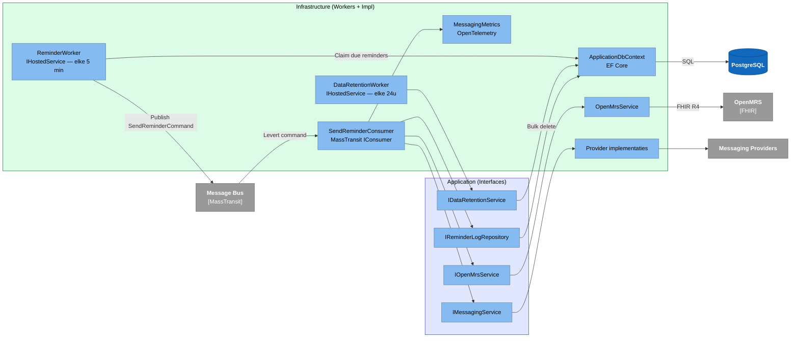

# C4 Level 3 — Componenten (Backend API)

Interne structuur van de ASP.NET Core backend, opgesplitst in twee views voor leesbaarheid.

## 3a · Synchrone request-flow

Inkomende HTTP-requests van API-clients en de OpenMRS-webhook.

## 3b · Asynchrone background-flow

Workers, message bus en consumers — los van inkomende requests.

