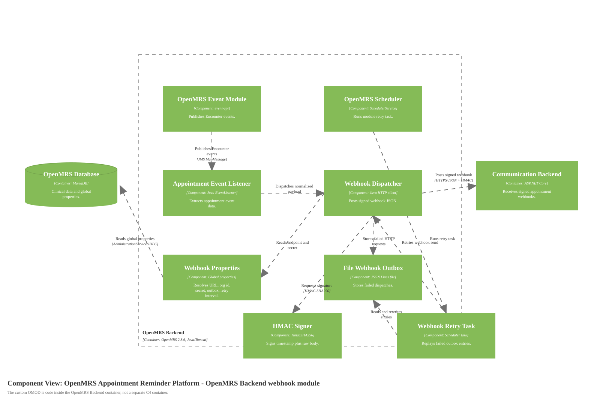

# Component Diagram for OpenMRS Appointment Webhook Module

Source: [diagrams/04-openmrs-webhook-module-components.svg](diagrams/04-openmrs-webhook-module-components.svg), generated by [generate-c4-diagrams.mjs](generate-c4-diagrams.mjs)

## Scope

One container from the container diagram: **OpenMRS Backend**, zoomed in only around the custom OpenMRS Appointment Webhook Module.

## Components

| Component | Technology | Responsibility |
|---|---|---|
| OpenMRS Event Module | OpenMRS `event-api`, JMS `MapMessage` | Emits `Encounter` create/update/void/unvoid events. |
| OpenMRS Scheduler | OpenMRS `SchedulerService` | Runs the webhook retry task on startup and repeat interval. |
| Event Subscription Registrar | Java OMOD component | Subscribes the appointment listener to Encounter events when the module starts. |
| Appointment Event Listener | Java `EventListener` | Extracts appointment-related values from OpenMRS event messages. |
| Webhook Dispatcher | Java `HttpURLConnection` | Builds JSON payloads and posts signed webhooks to the backend. |
| HMAC Signer | Java `HmacSHA256` | Signs `timestamp + "." + body` with the hospital-specific secret. |
| Webhook Properties | OpenMRS global properties | Resolves endpoint URL, organization id, secret, outbox path, and retry interval. |
| File Webhook Outbox | JSON Lines file | Stores failed outbound webhook requests in the OpenMRS data volume. |
| Webhook Retry Task | OpenMRS scheduler task | Replays failed outbox entries and preserves new entries written during retry. |

## Diagram Key

| Notation | Meaning |
|---|---|
| Component | Logical grouping of custom Java module code or OpenMRS runtime service inside the OpenMRS backend container. |
| Container/Database outside boundary | Parent-level runtime dependencies from the container diagram. |
| Solid arrow | One-way relationship. Inter-process relationships include protocol/technology labels. |
| Logos/icons | None used. Module responsibilities are expressed with C4 text labels. |
