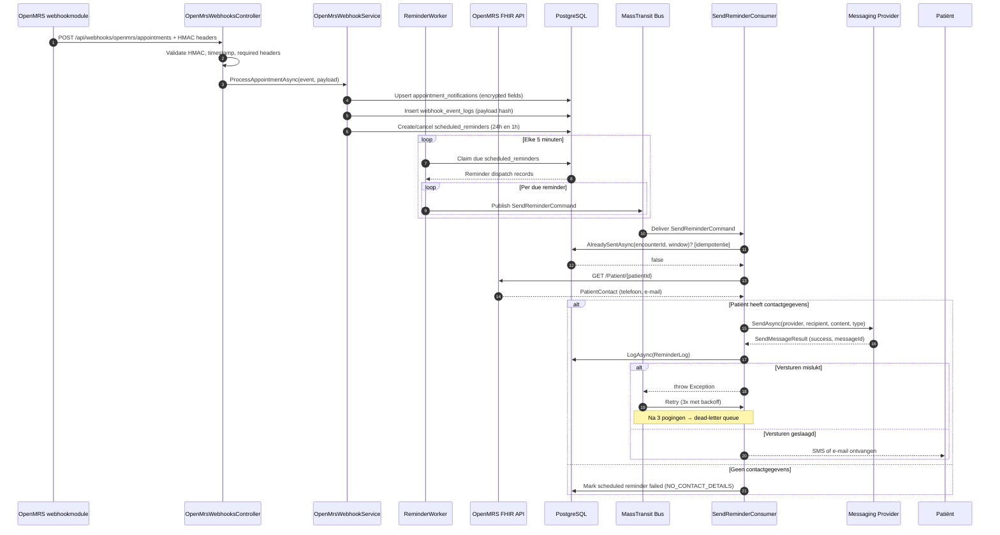
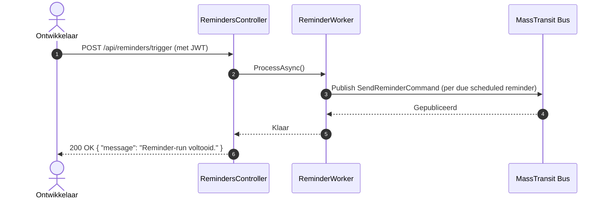
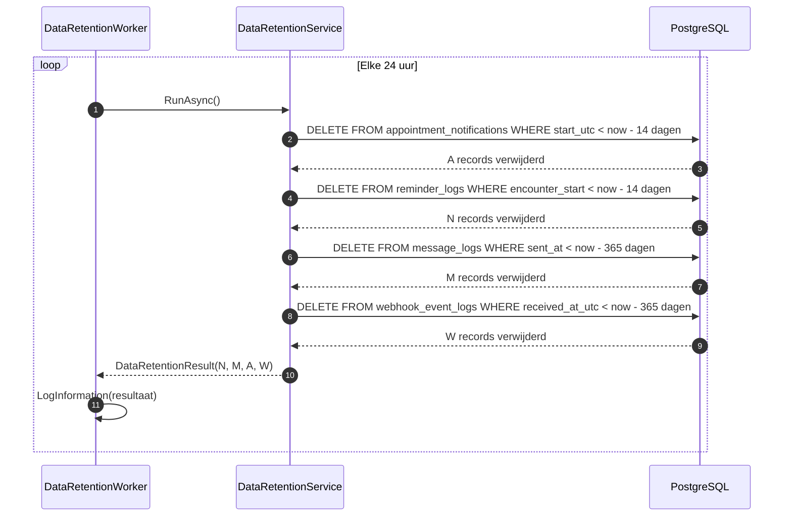

# Procesdiagram — Afspraakherinnering Flow

Stap-voor-stap weergave van hoe een afspraakherinnering van OpenMRS naar de patiënt gaat.

## Webhook en automatische flow

## Handmatige trigger (voor testen)

## Data-retentie flow (elke 24 uur)

