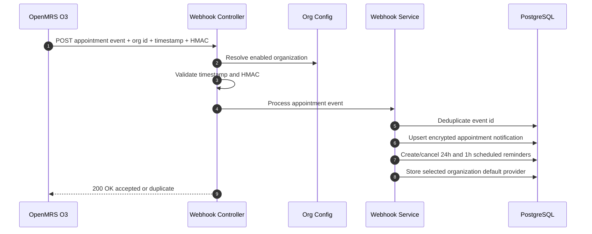
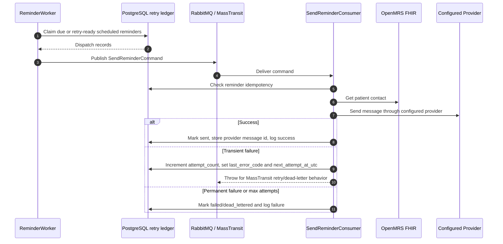
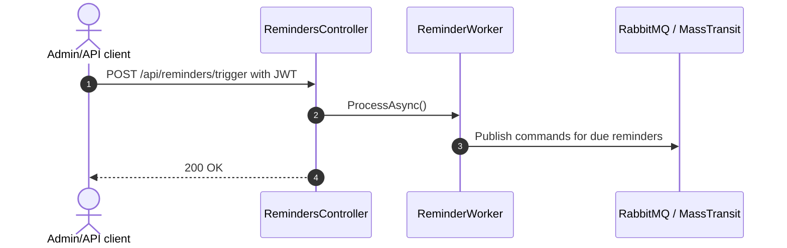
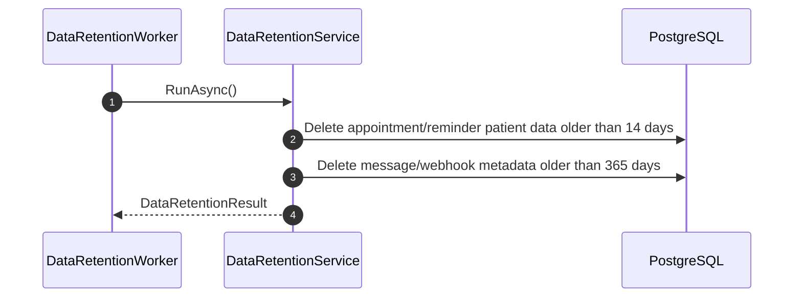

# Reminder Process

## Webhook To Durable Reminder State

## Durable Delivery And Retry

No automatic provider fallback occurs. Retries target the same provider selected by organization configuration unless an operator changes configuration and intentionally requeues work.

## Manual Trigger

## Retention

