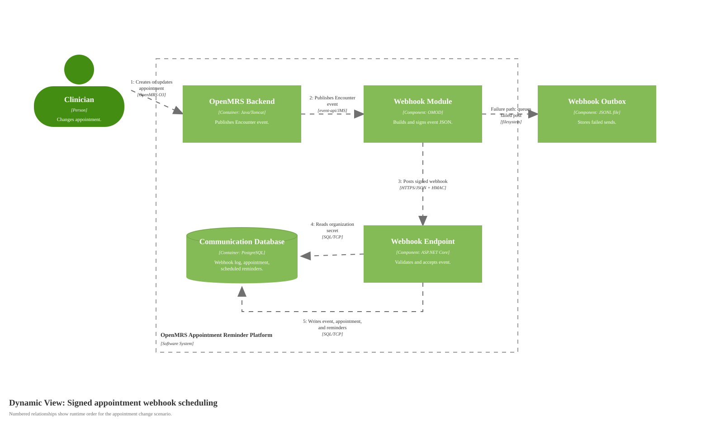

# Dynamic Diagram for Signed Appointment Webhook Scheduling

Source: [diagrams/05-appointment-webhook-dynamic.svg](diagrams/05-appointment-webhook-dynamic.svg), generated by [generate-c4-diagrams.mjs](generate-c4-diagrams.mjs)

## Scope

One runtime scenario: an OpenMRS appointment event is accepted and converted into scheduled reminder intent.

## Runtime Story

The OpenMRS webhook module emits a signed HTTP event after an Encounter change. The backend validates the organization, timestamp, and HMAC before it records the event. Accepted non-duplicate events update appointment state and recompute 24-hour and 1-hour reminders in PostgreSQL. If the OpenMRS module cannot post the webhook, it writes the failed request to its filesystem outbox for scheduler retry.

## Diagram Key

| Notation | Meaning |
|---|---|
| Dynamic diagram | Supporting C4 diagram showing a selected runtime scenario. |
| Numbered arrow | Ordered interaction in the runtime scenario. |
| Component | Code-level unit inside a container from the static model. |
| Database | Durable data store used during this scenario. |
| Solid arrow | One-way interaction. Labels include protocol/technology where the interaction crosses a process boundary. |
| Logos/icons | None used. |
