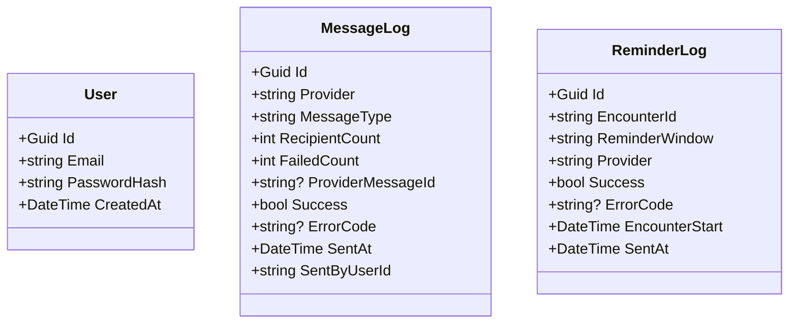
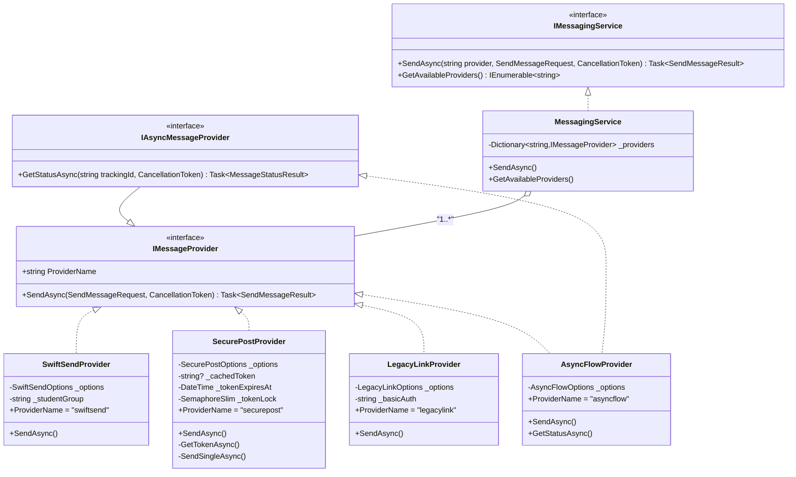
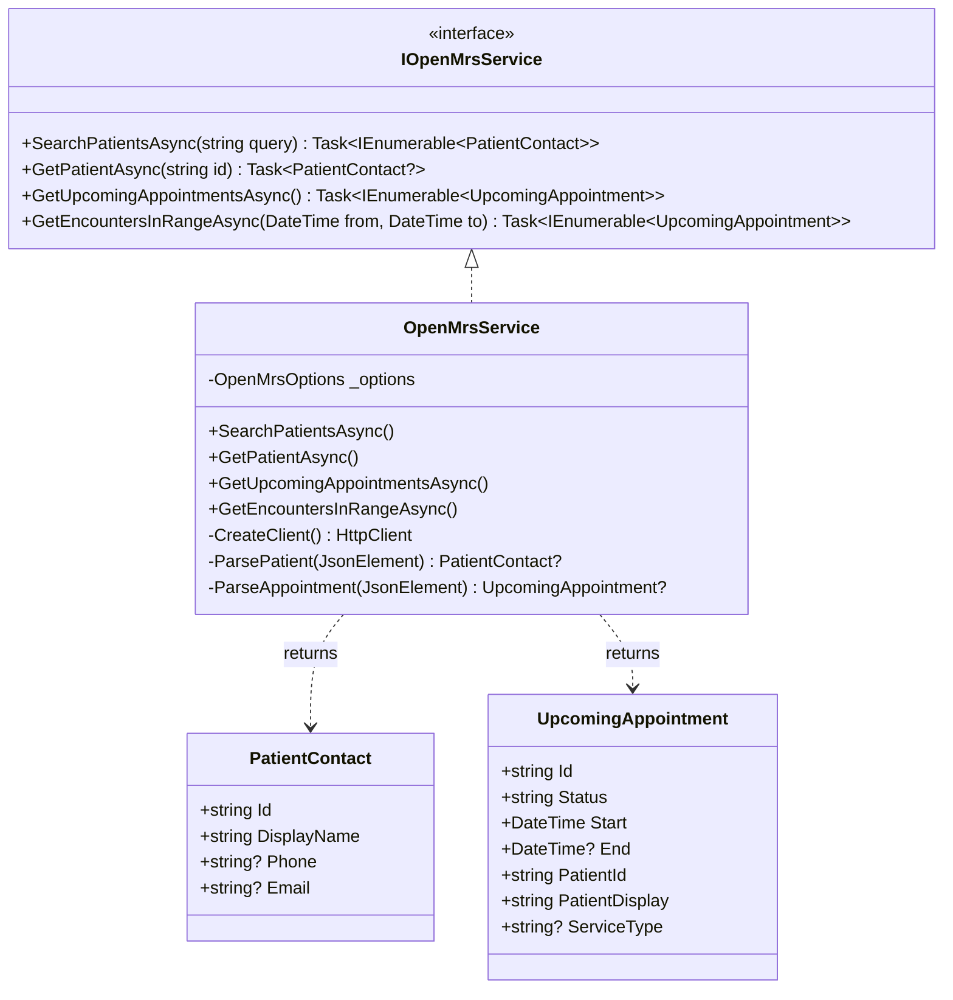
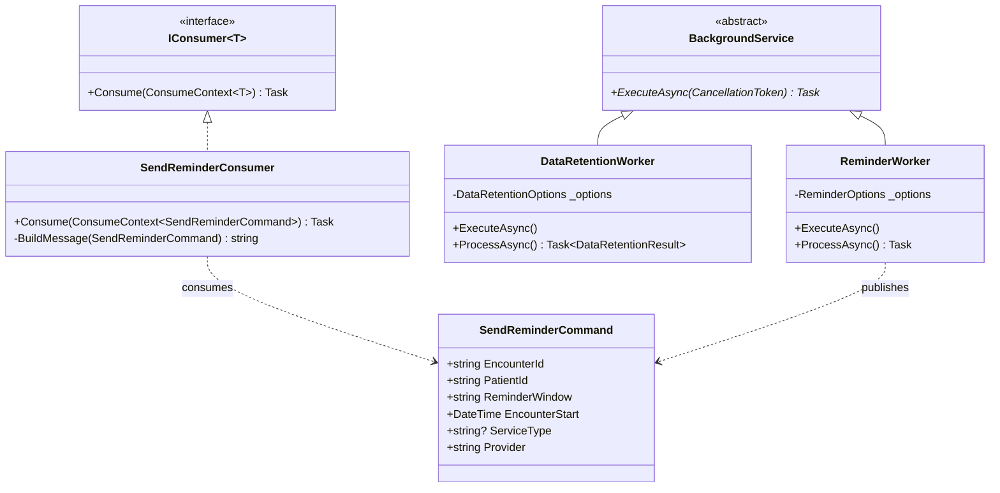

# UML Klassediagram — Domain & Application Layer

## Domeinentiteiten

```mermaid
classDiagram
    class User {
        +Guid Id
        +string Email
        +string PasswordHash
        +DateTime CreatedAt
    }

    class MessageLog {
        +Guid Id
        +string Provider
        +string MessageType
        +int RecipientCount
        +int FailedCount
        +string? ProviderMessageId
        +bool Success
        +string? ErrorCode
        +DateTime SentAt
        +string SentByUserId
    }

    class ReminderLog {
        +Guid Id
        +string EncounterId
        +string ReminderWindow
        +string Provider
        +bool Success
        +string? ErrorCode
        +DateTime EncounterStart
        +DateTime SentAt
    }
```

## Messaging providers (Strategy Pattern)

```mermaid
classDiagram
    class IMessageProvider {
        <<interface>>
        +string ProviderName
        +SendAsync(SendMessageRequest, CancellationToken) Task~SendMessageResult~
    }

    class IAsyncMessageProvider {
        <<interface>>
        +GetStatusAsync(string trackingId, CancellationToken) Task~MessageStatusResult~
    }

    class IMessagingService {
        <<interface>>
        +SendAsync(string provider, SendMessageRequest, CancellationToken) Task~SendMessageResult~
        +GetAvailableProviders() IEnumerable~string~
    }

    class SwiftSendProvider {
        -SwiftSendOptions _options
        -string _studentGroup
        +ProviderName = "swiftsend"
        +SendAsync()
    }

    class SecurePostProvider {
        -SecurePostOptions _options
        -string? _cachedToken
        -DateTime _tokenExpiresAt
        -SemaphoreSlim _tokenLock
        +ProviderName = "securepost"
        +SendAsync()
        -GetTokenAsync()
        -SendSingleAsync()
    }

    class LegacyLinkProvider {
        -LegacyLinkOptions _options
        -string _basicAuth
        +ProviderName = "legacylink"
        +SendAsync()
    }

    class AsyncFlowProvider {
        -AsyncFlowOptions _options
        +ProviderName = "asyncflow"
        +SendAsync()
        +GetStatusAsync()
    }

    class MessagingService {
        -Dictionary~string,IMessageProvider~ _providers
        +SendAsync()
        +GetAvailableProviders()
    }

    IMessageProvider <|.. SwiftSendProvider
    IMessageProvider <|.. SecurePostProvider
    IMessageProvider <|.. LegacyLinkProvider
    IMessageProvider <|.. AsyncFlowProvider
    IAsyncMessageProvider <|.. AsyncFlowProvider
    IAsyncMessageProvider --|> IMessageProvider
    IMessagingService <|.. MessagingService
    MessagingService o-- IMessageProvider : "1..*"
```

## OpenMRS integratie

```mermaid
classDiagram
    class IOpenMrsService {
        <<interface>>
        +SearchPatientsAsync(string query) Task~IEnumerable~PatientContact~~
        +GetPatientAsync(string id) Task~PatientContact?~
        +GetUpcomingAppointmentsAsync() Task~IEnumerable~UpcomingAppointment~~
        +GetEncountersInRangeAsync(DateTime from, DateTime to) Task~IEnumerable~UpcomingAppointment~~
    }

    class OpenMrsService {
        -OpenMrsOptions _options
        +SearchPatientsAsync()
        +GetPatientAsync()
        +GetUpcomingAppointmentsAsync()
        +GetEncountersInRangeAsync()
        -CreateClient() HttpClient
        -ParsePatient(JsonElement) PatientContact?
        -ParseAppointment(JsonElement) UpcomingAppointment?
    }

    class PatientContact {
        +string Id
        +string DisplayName
        +string? Phone
        +string? Email
    }

    class UpcomingAppointment {
        +string Id
        +string Status
        +DateTime Start
        +DateTime? End
        +string PatientId
        +string PatientDisplay
        +string? ServiceType
    }

    IOpenMrsService <|.. OpenMrsService
    OpenMrsService ..> PatientContact : returns
    OpenMrsService ..> UpcomingAppointment : returns
```

## Background services & MassTransit

```mermaid
classDiagram
    class BackgroundService {
        <<abstract>>
        +ExecuteAsync(CancellationToken)* Task
    }

    class ReminderWorker {
        -ReminderOptions _options
        +ExecuteAsync()
        +ProcessAsync() Task
    }

    class DataRetentionWorker {
        -DataRetentionOptions _options
        +ExecuteAsync()
        +ProcessAsync() Task~DataRetentionResult~
    }

    class IConsumer~T~ {
        <<interface>>
        +Consume(ConsumeContext~T~) Task
    }

    class SendReminderConsumer {
        +Consume(ConsumeContext~SendReminderCommand~) Task
        -BuildMessage(SendReminderCommand) string
    }

    class SendReminderCommand {
        +string EncounterId
        +string PatientId
        +string ReminderWindow
        +DateTime EncounterStart
        +string? ServiceType
        +string Provider
    }

    BackgroundService <|-- ReminderWorker
    BackgroundService <|-- DataRetentionWorker
    IConsumer~SendReminderCommand~ <|.. SendReminderConsumer
    SendReminderConsumer ..> SendReminderCommand : consumes
    ReminderWorker ..> SendReminderCommand : publishes
```
