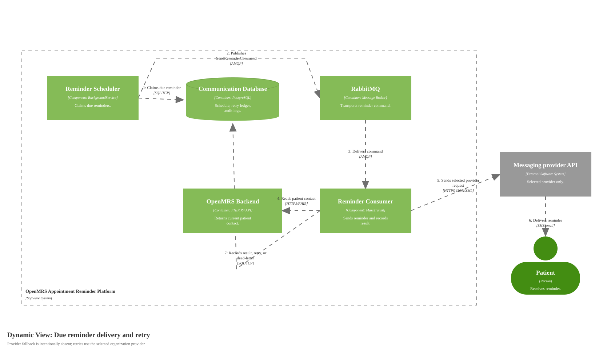

# Dynamic Diagram for Due Reminder Delivery and Retry

Source: [diagrams/06-reminder-delivery-dynamic.svg](diagrams/06-reminder-delivery-dynamic.svg), generated by [generate-c4-diagrams.mjs](generate-c4-diagrams.mjs)

## Scope

One runtime scenario: a scheduled reminder becomes due, is transported through RabbitMQ, and is either sent, retried, failed permanently, or dead-lettered.

## Runtime Story

The webhook does not call providers directly. Reminder intent is stored in PostgreSQL. The scheduler claims due work and publishes `SendReminderCommand` through RabbitMQ. The consumer reads current patient contact from OpenMRS, renders the configured template, sends through the selected provider for that organization, and records queue/provider/retry evidence back to PostgreSQL.

Provider fallback is intentionally absent. A failed send is retried against the same selected provider according to retry policy until it succeeds, fails permanently, or reaches dead-letter state.

## Diagram Key

| Notation | Meaning |
|---|---|
| Dynamic diagram | Supporting C4 diagram showing a selected runtime scenario. |
| Numbered arrow | Ordered interaction. |
| Queue | Durable broker transport between scheduler and consumer. |
| Database | PostgreSQL retry ledger and source of truth. |
| External Software System | Provider APIs outside the platform boundary. |
| Solid arrow | One-way interaction. Labels include protocol/technology where useful. |
| Logos/icons | None used. |
