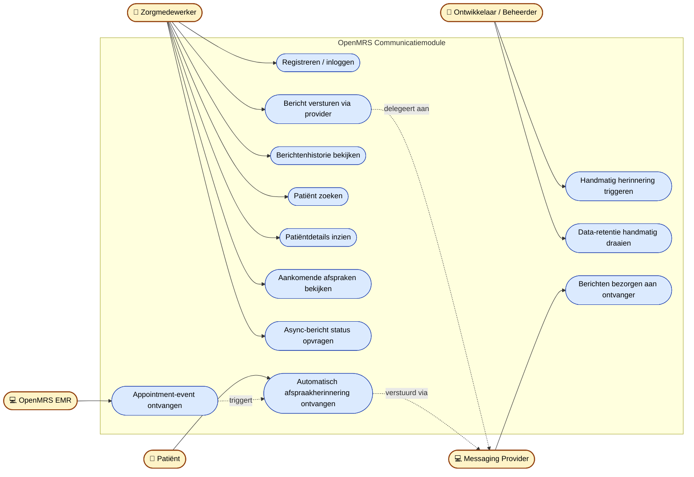

# Use Case Diagram — OpenMRS Communicatiemodule

Welke actoren gebruiken het systeem en welke functionaliteiten hebben zij tot hun beschikking?

## Actoren

| Actor | Rol |
|---|---|
| **Zorgmedewerker** | Primaire gebruiker — beheert berichten, bekijkt patiënten en geschiedenis via de webinterface |
| **Patiënt** | Indirecte eindgebruiker — ontvangt automatische herinneringen, geen directe interactie met het systeem |
| **Ontwikkelaar / Beheerder** | Handmatige triggers, monitoring en data-retentie |
| **OpenMRS EMR** | Extern systeem — bron van patiëntdata en afspraak-events |
| **Messaging Provider** | Extern systeem — bezorgt SMS, e-mail en push-berichten |

## Use case diagram

## Use case beschrijvingen

### UC1 — Registreren / inloggen
**Actor:** Zorgmedewerker
**Doel:** Toegang krijgen tot de applicatie met een persoonlijk account.
**Stappen:** Vult e-mail + wachtwoord in → server valideert → JWT-token retour → opgeslagen in `localStorage`.
**Beveiliging:** Rate-limit 5 pogingen/minuut, NIST-wachtwoordbeleid (12 tekens), account-lockout na 5 fouten.

### UC2 — Bericht versturen via provider
**Actor:** Zorgmedewerker
**Doel:** Eén of meer patiënten een bericht sturen via een gekozen provider.
**Stappen:** Provider kiezen → ontvangers + bericht invoeren → versturen → bericht-log wordt aangemaakt.
**Providers:** SwiftSend (REST/X-API-KEY), SecurePost (REST/JWT), LegacyLink (SOAP/Basic), AsyncFlow (Async REST).

### UC3 — Berichtenhistorie bekijken
**Actor:** Zorgmedewerker
**Doel:** Verzonden berichten inzien voor audit en factuurcontrole.
**Bewaarperiode:** 365 dagen, alleen meta-informatie (geen PII).

### UC4 — Patiënt zoeken
**Actor:** Zorgmedewerker
**Doel:** Patiënten opzoeken op naam via OpenMRS FHIR R4.

### UC5 — Patiëntdetails inzien
**Actor:** Zorgmedewerker
**Doel:** Contactgegevens (telefoon, e-mail) van één patiënt inzien.

### UC6 — Aankomende afspraken bekijken
**Actor:** Zorgmedewerker
**Doel:** Encounters/afspraken in een datumbereik tonen.

### UC7 — Async-bericht status opvragen
**Actor:** Zorgmedewerker
**Doel:** Voor AsyncFlow-berichten de verwerkingsstatus pollen via `trackingId`.

### UC8 — Automatisch afspraakherinnering ontvangen
**Actor:** Patiënt
**Doel:** Tijdig herinnerd worden aan een aanstaande afspraak (24h en 1h vooraf).
**Trigger:** Appointment-event vanuit OpenMRS (UC9) → `ReminderWorker` plant en publiceert → consumer verstuurt.

### UC9 — Appointment-event ontvangen
**Actor:** OpenMRS EMR
**Doel:** Wijzigingen in afspraken doorgeven via signed webhook.
**Beveiliging:** HMAC-SHA256, timestamp ± 5 min, idempotentie op `eventId`, encrypted opslag patiëntdata.

### UC10 — Handmatig herinnering triggeren
**Actor:** Ontwikkelaar
**Doel:** Voor test/debug de reminder-cyclus direct draaien zonder te wachten op het 5-minuten interval.

### UC11 — Data-retentie handmatig draaien
**Actor:** Ontwikkelaar
**Doel:** Verlopen patiëntdata (14 dagen) en meta-logs (365 dagen) verwijderen.

### UC12 — Berichten bezorgen aan ontvanger
**Actor:** Messaging Provider
**Doel:** Het feitelijke versturen van SMS/e-mail/push naar de patiënt.
