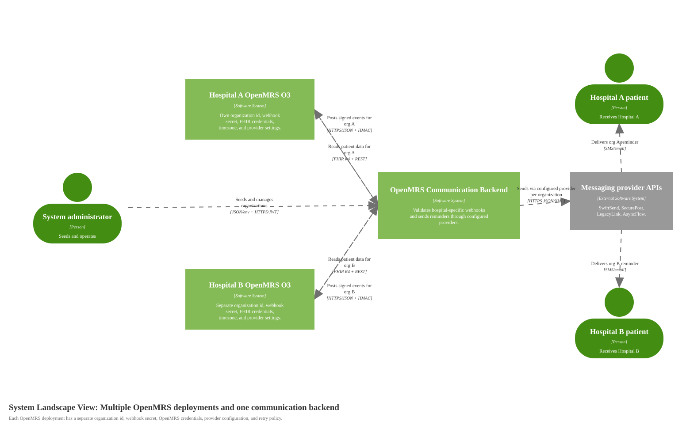

# System Landscape Diagram for Multi-Hospital OpenMRS Integration

Source: [diagrams/07-multi-hospital-landscape.svg](diagrams/07-multi-hospital-landscape.svg), generated by [generate-c4-diagrams.mjs](generate-c4-diagrams.mjs)

## Scope

Multiple software systems in the operating landscape: more than one OpenMRS O3 hospital deployment and one communication backend.

## Model Notes

Each OpenMRS deployment has its own stable `organization_id`, webhook secret, OpenMRS credentials, timezone, poller settings, retry policy, default provider, and provider credentials. The backend never silently falls back to another organization's webhook secret or provider configuration.

Polling is a compatibility mode only. The preferred integration is signed webhook delivery from each OpenMRS deployment.

## Diagram Key

| Notation | Meaning |
|---|---|
| System Landscape diagram | Supporting C4 diagram showing multiple software systems and their relationships. |
| Person | Human role affected by or operating the landscape. |
| Software System | Independently deployed system in the landscape. |
| External Software System | Provider or monitoring system outside the product boundary. |
| Solid arrow | One-way relationship with label and protocol/technology where useful. |
| Logos/icons | None used. |
