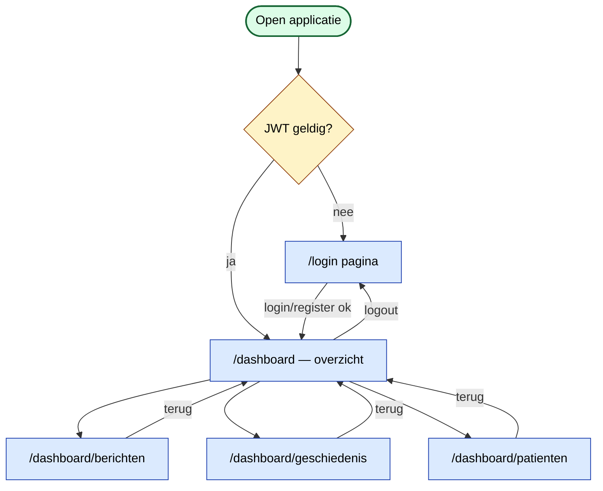
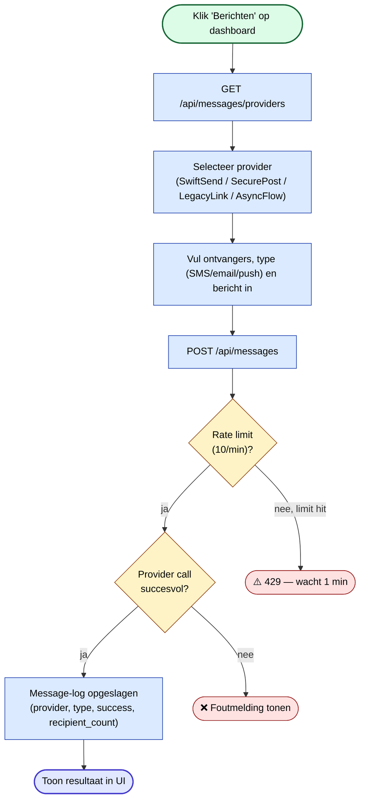
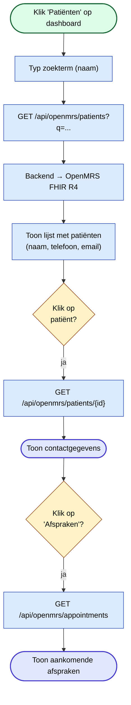
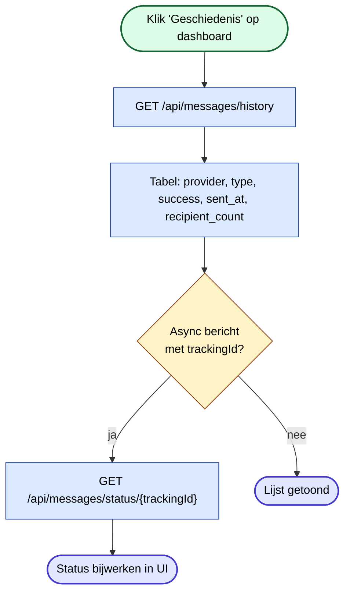
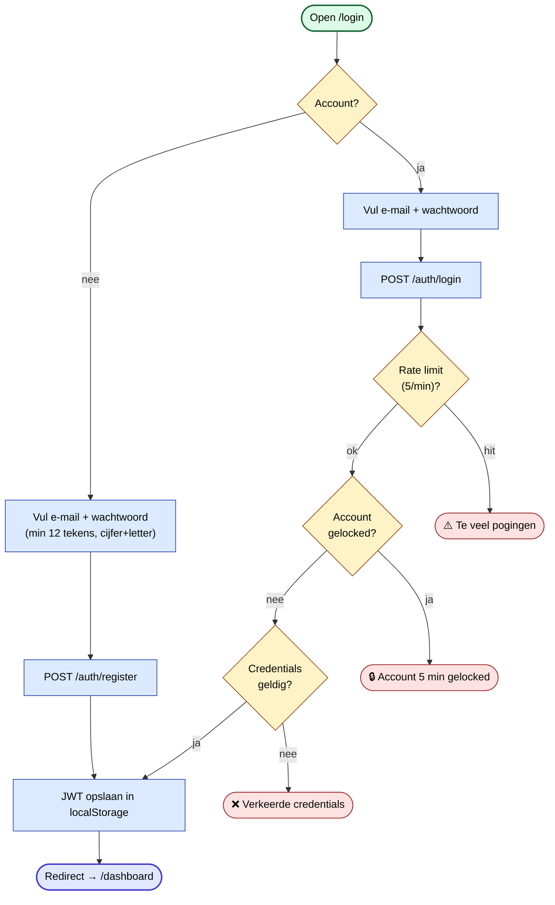

# User Flow — Zorgmedewerker

De stappen die een zorgmedewerker in de webinterface doorloopt voor de belangrijkste taken.

## Globale navigatie

## Flow 1 — Bericht versturen

## Flow 2 — Patiënt zoeken en details inzien

## Flow 3 — Geschiedenis bekijken

## Flow 4 — Login / registratie

