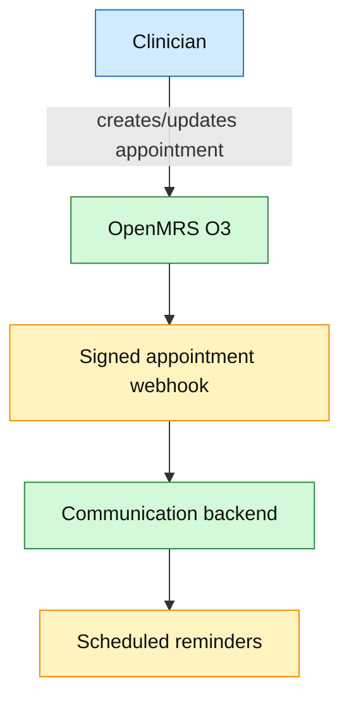
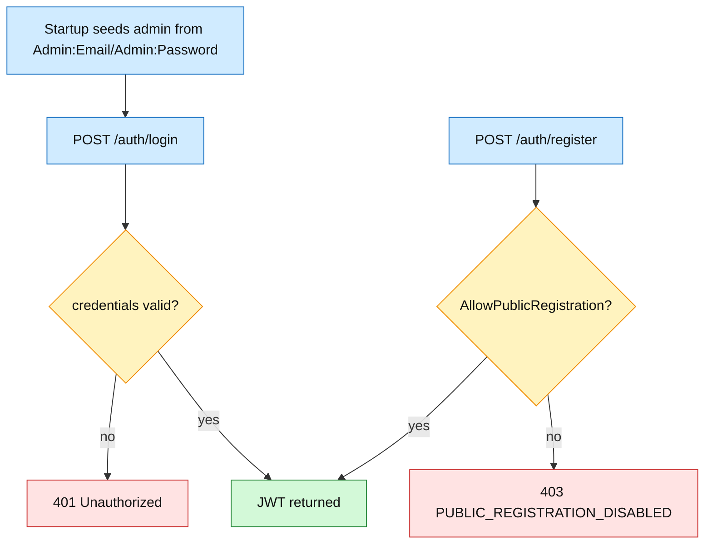
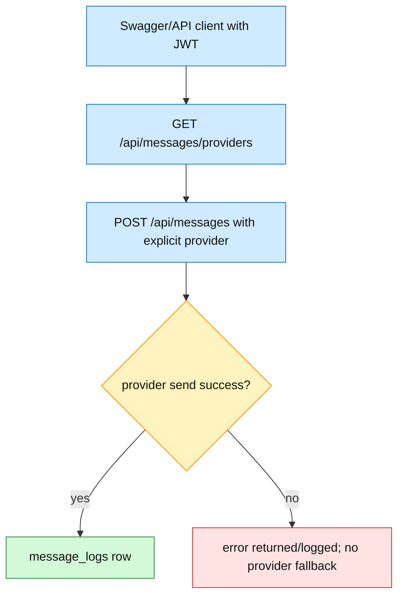

# API And OpenMRS O3 Flows

The custom web frontend has been removed. Clinicians use OpenMRS O3 for clinical workflows. Backend interactions are OpenMRS webhooks, FHIR calls, Swagger/API clients, and admin endpoints.

## Clinician Appointment Flow

## Admin Auth Flow

## Direct Message API Flow

