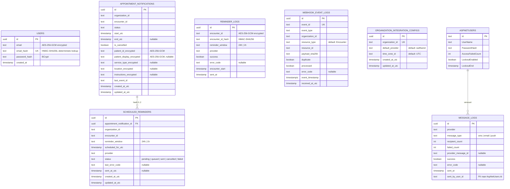

# ER-diagram — Database schema

Het PostgreSQL-schema van de OpenMRS Communicatiemodule. Tabelnamen volgen `snake_case` conventie (geconfigureerd in [ApplicationDbContext](../../Infrastructure/Persistence/ApplicationDbContext.cs)).

## Overzicht

## Toelichting

### Encryptie (AES-256-GCM)
Velden met PII worden bij opslag versleuteld via `IEncryptionService` (ValueConverter in `OnModelCreating`). Voor zoeken op email/encounter is een aparte HMAC-SHA256-hash kolom — deterministisch en daardoor indexeerbaar.

| Tabel | Encrypted velden | Hash-kolom |
|---|---|---|
| `users` | `email` | `email_hash` (unique) |
| `reminder_logs` | `encounter_id` | `encounter_id_hash` (compound index met `reminder_window`) |
| `appointment_notifications` | `patient_id`, `patient_display`, `service_type`, `location`, `instructions` | — |

### Relaties
- **`scheduled_reminders` → `appointment_notifications`** (FK, ON DELETE CASCADE). Per afspraak max 2 reminders: één 24h vooraf, één 1h vooraf.
- **`message_logs.sent_by_user_id` → `AspNetUsers.Id`** (geen FK constraint — losse koppeling, want users kunnen worden verwijderd terwijl logs bewaard blijven).

### Indices
| Tabel | Index | Doel |
|---|---|---|
| `users` | `email_hash` UNIQUE | Login + uniciteitscheck |
| `reminder_logs` | `(encounter_id_hash, reminder_window)` | Idempotentie-check in `SendReminderConsumer` |
| `appointment_notifications` | `(organization_id, encounter_id)` UNIQUE | Upsert vanuit webhook |
| `scheduled_reminders` | `(status, scheduled_for_utc)` | `ReminderWorker` claim-query |
| `scheduled_reminders` | `(appointment_notification_id, reminder_window)` | Cancel/upsert reminders |
| `webhook_event_logs` | `event_id` UNIQUE | Idempotentie webhook |
| `webhook_event_logs` | `received_at_utc` | Data-retentie query |
| `organization_integration_configs` | `organization_id` UNIQUE | Per-org config lookup |
| `message_logs` | `sent_at` | History-paginering |

### Data-retentie ([ADR-0010](../adr/0010-data-retention-and-encryption-policy.md))
- **14 dagen** — `appointment_notifications`, `reminder_logs` (bevatten patiëntdata)
- **365 dagen** — `message_logs`, `webhook_event_logs` (alleen meta-informatie)

### Identity tabellen
Daarnaast bestaan de standaard ASP.NET Core Identity-tabellen (`AspNetUsers`, `AspNetRoles`, `AspNetUserClaims`, etc.) voor authenticatie. Deze worden beheerd door `IdentityDbContext<IdentityUser>` en zijn niet als domeinentiteit opgenomen.
