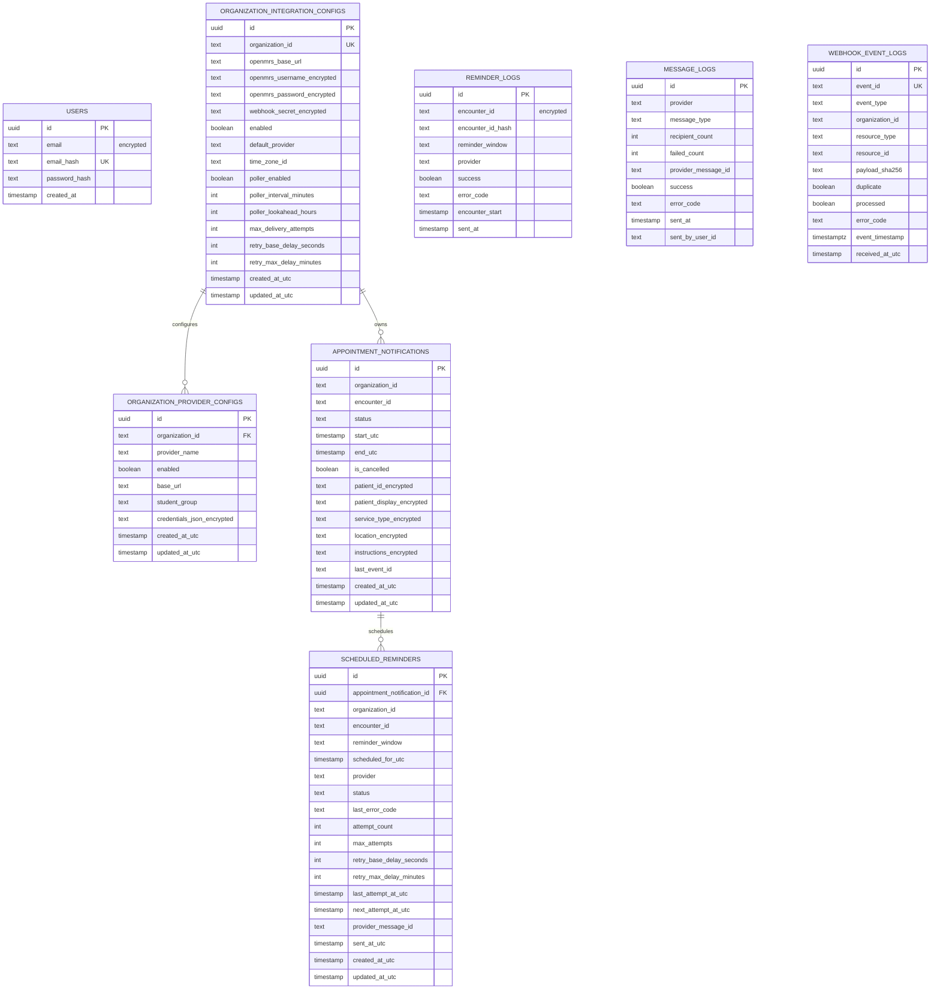

# ER Diagram - PostgreSQL Model

PostgreSQL is the source of truth for configuration, appointment state, scheduled reminders, retry ledger fields, audit logs, and authentication.

```mermaid
erDiagram
    USERS {
        uuid id PK
        text email "encrypted"
        text email_hash UK
        text password_hash
        timestamp created_at
    }

    ORGANIZATION_INTEGRATION_CONFIGS {
        uuid id PK
        text organization_id UK
        text openmrs_base_url
        text openmrs_username_encrypted
        text openmrs_password_encrypted
        text webhook_secret_encrypted
        boolean enabled
        text default_provider
        text time_zone_id
        boolean poller_enabled
        int poller_interval_minutes
        int poller_lookahead_hours
        int max_delivery_attempts
        int retry_base_delay_seconds
        int retry_max_delay_minutes
        timestamp created_at_utc
        timestamp updated_at_utc
    }

    ORGANIZATION_PROVIDER_CONFIGS {
        uuid id PK
        text organization_id FK
        text provider_name
        boolean enabled
        text base_url
        text student_group
        text credentials_json_encrypted
        timestamp created_at_utc
        timestamp updated_at_utc
    }

    APPOINTMENT_NOTIFICATIONS {
        uuid id PK
        text organization_id
        text encounter_id
        text status
        timestamp start_utc
        timestamp end_utc
        boolean is_cancelled
        text patient_id_encrypted
        text patient_display_encrypted
        text service_type_encrypted
        text location_encrypted
        text instructions_encrypted
        text last_event_id
        timestamp created_at_utc
        timestamp updated_at_utc
    }

    SCHEDULED_REMINDERS {
        uuid id PK
        uuid appointment_notification_id FK
        text organization_id
        text encounter_id
        text reminder_window
        timestamp scheduled_for_utc
        text provider
        text status
        text last_error_code
        int attempt_count
        int max_attempts
        int retry_base_delay_seconds
        int retry_max_delay_minutes
        timestamp last_attempt_at_utc
        timestamp next_attempt_at_utc
        text provider_message_id
        timestamp sent_at_utc
        timestamp created_at_utc
        timestamp updated_at_utc
    }

    REMINDER_LOGS {
        uuid id PK
        text encounter_id "encrypted"
        text encounter_id_hash
        text reminder_window
        text provider
        boolean success
        text error_code
        timestamp encounter_start
        timestamp sent_at
    }

    MESSAGE_LOGS {
        uuid id PK
        text provider
        text message_type
        int recipient_count
        int failed_count
        text provider_message_id
        boolean success
        text error_code
        timestamp sent_at
        text sent_by_user_id
    }

    WEBHOOK_EVENT_LOGS {
        uuid id PK
        text event_id UK
        text event_type
        text organization_id
        text resource_type
        text resource_id
        text payload_sha256
        boolean duplicate
        boolean processed
        text error_code
        timestamptz event_timestamp
        timestamp received_at_utc
    }

    ORGANIZATION_INTEGRATION_CONFIGS ||--o{ ORGANIZATION_PROVIDER_CONFIGS : configures
    ORGANIZATION_INTEGRATION_CONFIGS ||--o{ APPOINTMENT_NOTIFICATIONS : owns
    APPOINTMENT_NOTIFICATIONS ||--o{ SCHEDULED_REMINDERS : schedules
```
