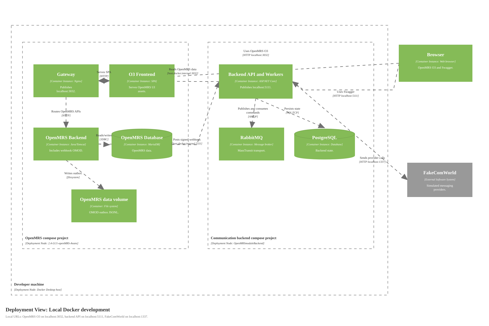

# Deployment Diagram for Local Docker Development

Source: [diagrams/08-local-deployment.svg](diagrams/08-local-deployment.svg), generated by [generate-c4-diagrams.mjs](generate-c4-diagrams.mjs)

## Scope

One deployment environment: local development on a developer machine using the two Docker Compose projects.

## Deployment Nodes

| Node | Type/Technology | Purpose |
|---|---|---|
| Developer machine | Windows/macOS/Linux with Docker Desktop | Hosts the local OpenMRS, backend, browser, and provider simulator environment. |
| Local browser | Browser or Playwright | Opens OpenMRS O3, backend Swagger, RabbitMQ management, and smoke checks. |
| OpenMRS compose project | Docker Compose | Runs OpenMRS gateway, O3 frontend, OpenMRS backend, MariaDB, and the OpenMRS data volume. |
| Communication backend compose project | Docker Compose | Runs ASP.NET Core API/workers, PostgreSQL, and RabbitMQ. |
| FakeComWorld | Local service/container | Simulates messaging provider APIs. |

## Diagram Key

| Notation | Meaning |
|---|---|
| Deployment Node | Runtime environment or nested infrastructure location. |
| Container instance | Running instance of a container from the static container diagram. |
| Database/Queue | Deployed data store or broker instance. |
| External container | Local tool/simulator outside the platform boundary. |
| Solid arrow | One-way runtime communication with protocol or local URL details. |
| Logos/icons | None used. |
