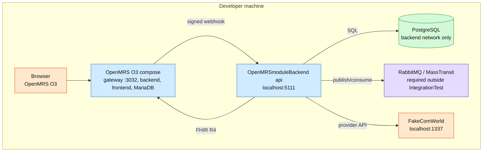
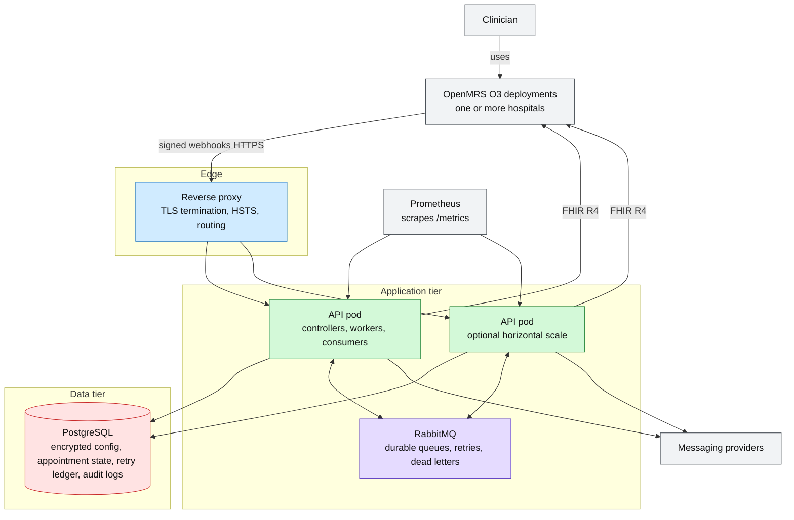

# Deployment

The deployment keeps the backend, PostgreSQL, and message broker separate from OpenMRS O3. OpenMRS remains the clinical UI and EMR. The backend is not paired with a custom Next.js frontend.

## Local Development

## Production Target

## Notes

- RabbitMQ is required for development, staging, and production delivery. Only `IntegrationTest` uses in-memory MassTransit.
- PostgreSQL is the source of truth for retry state; RabbitMQ is the transport, not the business ledger.
- Multiple OpenMRS O3 deployments are separated by organization id and per-org secrets.
- Provider fallback is not automatic. Operational retry targets the same configured provider.
