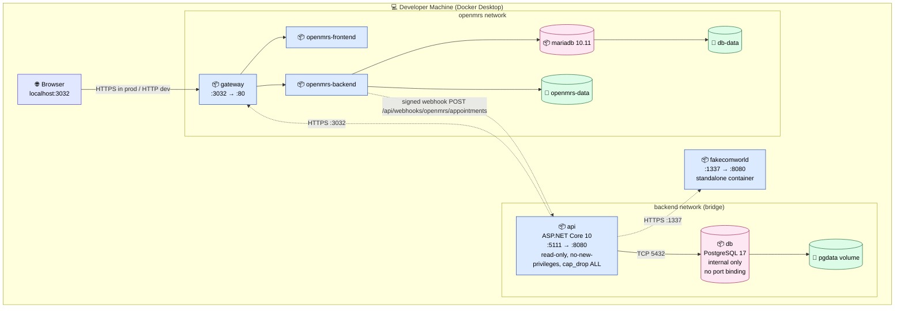
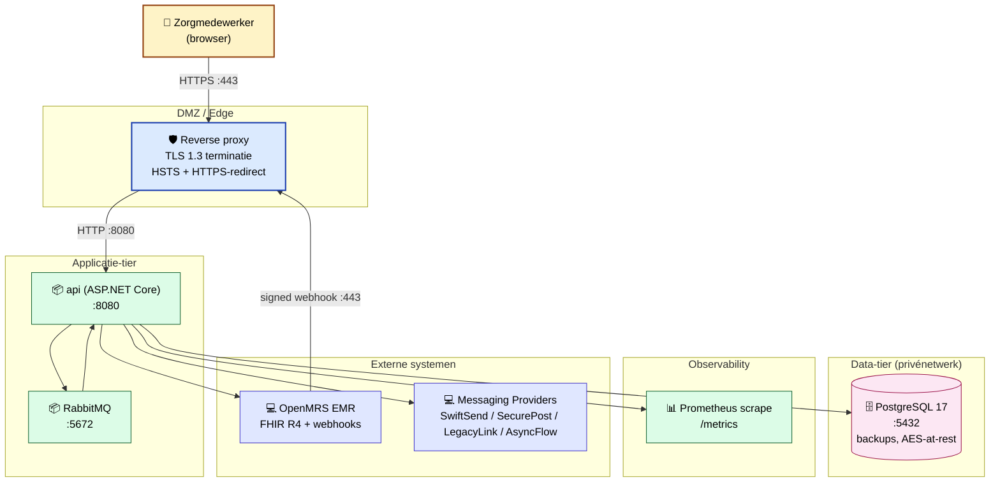

# Deployment Diagram — OpenMRS Communicatiemodule

Hoe het systeem fysiek wordt gedeployd: containers, netwerken, poorten en volumes. Gebaseerd op de drie `docker-compose.yml` bestanden.

## Lokale ontwikkelomgeving (Docker Compose)

## Container-overzicht

| Container | Image | Poorten | Volume | Security |
|---|---|---|---|---|
| `api` | `OpenMRSmoduleBackend` (custom build) | `127.0.0.1:5111 → 8080` | tmpfs `/tmp` | read_only, cap_drop ALL, no-new-privileges |
| `db` | `postgres:17-alpine` | — (internal only) | `pgdata` | no-new-privileges |
| `gateway` | `openmrs/openmrs-reference-application-3-gateway:qa` | `3032:80` | — | — |
| `openmrs-frontend` | `openmrs/openmrs-reference-application-3-frontend:qa` | — | — | — |
| `openmrs-backend` | `openmrs/openmrs-reference-application-3-backend:qa` | `5005:5005` (debug) | `openmrs-data` | — |
| `openmrs-db` | `mariadb:10.11.7` | — | `db-data` | — |
| `fakecomworld` | `ghcr.io/avansict/in2.4-fakecomworld:main` | `1337:8080` | — | — |

## Productie deployment (target architectuur)

## Security & netwerk-eisen

| Maatregel | Implementatie |
|---|---|
| **TLS 1.3** | Reverse proxy in productie. `app.UseHsts()` + `UseHttpsRedirection()` in Program.cs |
| **DB-isolatie** | PostgreSQL geen public port binding (`docker-compose.yml`). Alleen `backend`-netwerk |
| **API-isolatie** | API gebind op `127.0.0.1:5111` in dev (`API_PORT=127.0.0.1:5111`) |
| **Container hardening** | `read_only: true`, `cap_drop: ALL`, `no-new-privileges:true`, tmpfs `/tmp` |
| **Secrets** | `.env`-file, nooit in image of compose-defaults ([ADR-0006](../adr/0006-secrets-via-env-file.md)) |
| **CORS** | Whitelist via `ALLOWED_ORIGINS` (standaard: OpenMRS op `:3032`), geen wildcard |
| **Rate limiting** | Per-IP: 5/min auth, 10/min messaging, 100/min global |
| **AES-256-GCM** | PII bij rust in DB (encounter_id, patient data) |

## Opstartvolgorde

`start.sh` start de stack in deze volgorde:
1. **FakeComWorld** — standalone container (geen netwerkafhankelijkheid)
2. **OpenMRS distro** — gateway + openmrs-frontend + openmrs-backend + mariadb (~2 min)
3. **Backend + Postgres** — eigen compose, leest `.env`

Het script sourcet credentials uit `OpenMRSmoduleBackend/.env` zodat er één bron van waarheid is.
