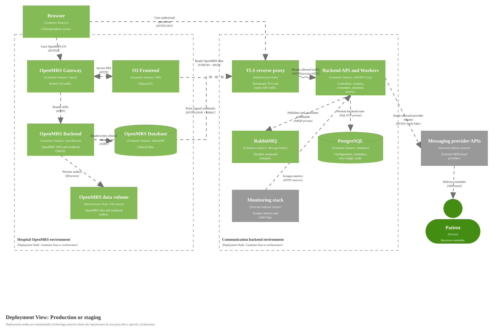

# Deployment Diagram for Production or Staging

Source: [diagrams/09-production-deployment.svg](diagrams/09-production-deployment.svg), generated by [generate-c4-diagrams.mjs](generate-c4-diagrams.mjs)

## Scope

One production or staging deployment environment. The OpenMRS hospital environment is shown once but repeats per integrated organization. The communication backend can serve more than one OpenMRS deployment through organization-scoped configuration.

## Deployment Nodes

| Node | Type/Technology | Purpose |
|---|---|---|
| Clinician or administrator device | Managed workstation/browser | Accesses OpenMRS O3 and authorized backend operations. |
| Hospital OpenMRS environment | Container host or orchestrator | Runs OpenMRS gateway, O3 frontend, OpenMRS backend with the webhook OMOD, MariaDB, and persistent OpenMRS data. |
| Communication backend environment | Container host or orchestrator | Runs TLS edge, backend API/workers, PostgreSQL, RabbitMQ, and monitoring. |
| Messaging provider APIs | External provider systems | Deliver SMS/email through configured provider contracts. |

## Security Notes

Database and RabbitMQ ports stay private to the backend environment. TLS is terminated at the deployment boundary. Webhooks remain authenticated by organization id, timestamp skew checks, and HMAC-SHA256 signatures. Metrics are scraped only from a restricted network path.

## Diagram Key

| Notation | Meaning |
|---|---|
| Deployment Node | Runtime environment or infrastructure location for container instances. |
| Container instance | Running instance of a container from the static container diagram. |
| Database/Queue | Deployed data store or broker instance. |
| External Software System | Provider service outside platform ownership. |
| Solid arrow | One-way runtime communication with protocol/technology label. |
| Logos/icons | None used. |
