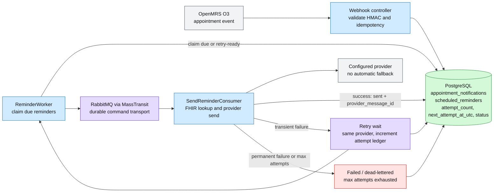

# Durable Delivery And Retry

```mermaid
flowchart LR
    classDef api fill:#d0ebff,stroke:#1971c2,color:#111
    classDef db fill:#d3f9d8,stroke:#2b8a3e,color:#111
    classDef queue fill:#e5dbff,stroke:#5f3dc4,color:#111
    classDef ext fill:#f1f3f5,stroke:#495057,color:#111
    classDef fail fill:#ffe3e3,stroke:#c92a2a,color:#111

    openmrs["OpenMRS O3<br/>appointment event"]:::ext
    webhook["Webhook controller<br/>validate HMAC and idempotency"]:::api
    pg[("PostgreSQL<br/>appointment_notifications<br/>scheduled_reminders<br/>attempt_count, next_attempt_at_utc, status")]:::db
    worker["ReminderWorker<br/>claim due reminders"]:::api
    rabbit["RabbitMQ via MassTransit<br/>durable command transport"]:::queue
    consumer["SendReminderConsumer<br/>FHIR lookup and provider send"]:::api
    provider["Configured provider<br/>no automatic fallback"]:::ext
    retry["Retry wait<br/>same provider, increment attempt ledger"]:::queue
    dead["Failed / dead-lettered<br/>max attempts exhausted"]:::fail

    openmrs --> webhook
    webhook --> pg
    worker -->|"claim due or retry-ready"| pg
    worker --> rabbit
    rabbit --> consumer
    consumer --> provider
    consumer -->|"success: sent + provider_message_id"| pg
    consumer -->|"transient failure"| retry
    retry --> pg
    retry --> worker
    consumer -->|"permanent failure or max attempts"| dead
    dead --> pg
```
