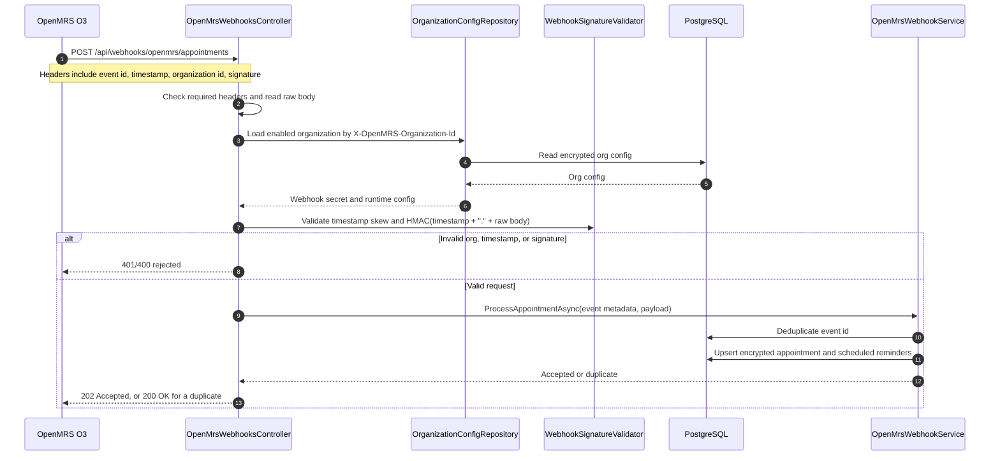

# Webhook Authentication Flow

```mermaid
sequenceDiagram
    autonumber
    participant OM as OpenMRS O3
    participant API as OpenMrsWebhooksController
    participant CFG as OrganizationConfigRepository
    participant SIG as WebhookSignatureValidator
    participant DB as PostgreSQL
    participant SVC as OpenMrsWebhookService

    OM->>API: POST /api/webhooks/openmrs/appointments
    Note over OM,API: Headers include event id, timestamp, organization id, signature
    API->>API: Check required headers and read raw body
    API->>CFG: Load enabled organization by X-OpenMRS-Organization-Id
    CFG->>DB: Read encrypted org config
    DB-->>CFG: Org config
    CFG-->>API: Webhook secret and runtime config
    API->>SIG: Validate timestamp skew and HMAC(timestamp + "." + raw body)
    alt Invalid org, timestamp, or signature
        API-->>OM: 401/400 rejected
    else Valid request
        API->>SVC: ProcessAppointmentAsync(event metadata, payload)
        SVC->>DB: Deduplicate event id
        SVC->>DB: Upsert encrypted appointment and scheduled reminders
        SVC-->>API: Accepted or duplicate
        API-->>OM: 202 Accepted, or 200 OK for a duplicate
    end
```
