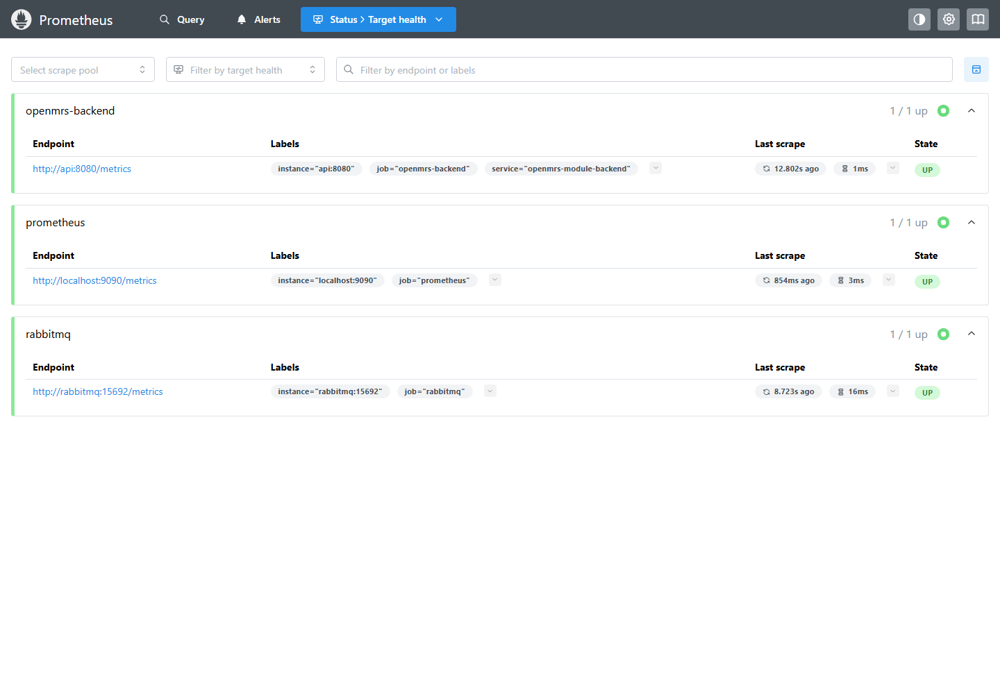
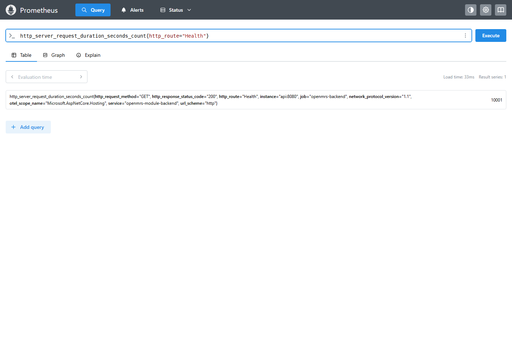
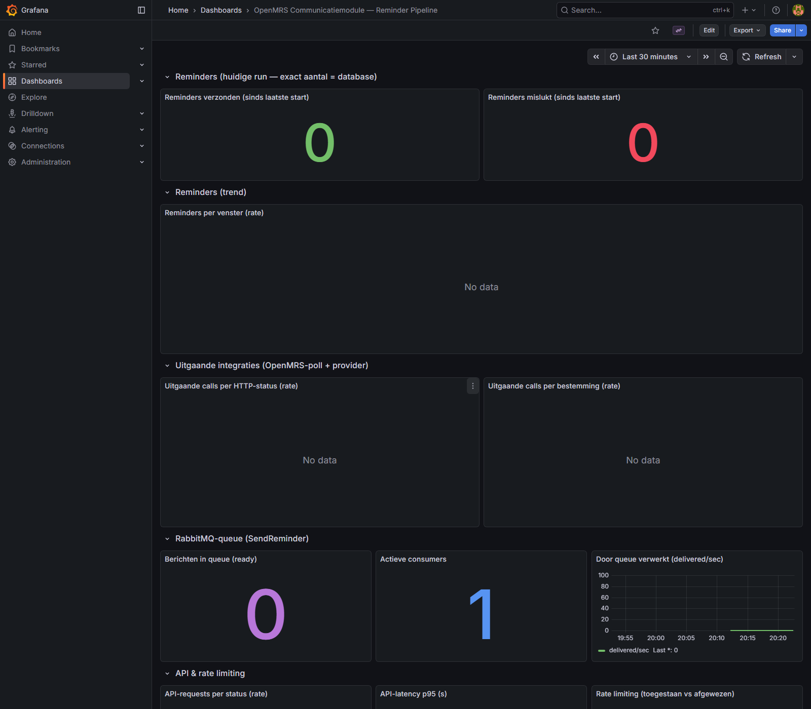

# Schaalbaarheid en robuustheid rapport

Datum: 2026-06-26  
Scope: `OpenMRSmoduleBackend` en de OpenMRS webhook-module in `2.4-LU1-openMRS-Avans`

## Samenvatting

De backend is functioneel robuust opgezet voor de huidige module-scope: PostgreSQL is de bron van waarheid, RabbitMQ verzorgt duurzame command-transport, OpenTelemetry/Prometheus levert metrics en de testset dekt authenticatie, webhook-validatie, idempotency, reminderplanning, retry-ledger en tenant-isolatie.

Uitgevoerde tests:

| Test | Resultaat | Bewijs |
|---|---:|---|
| Backend xUnit + integratie + loadtest | 45 geslaagd, 0 gefaald | `OpenMRSmoduleBackend.Tests/TestResults/backend-tests-full.trx` |
| Gerichte backend-loadtest | 10.000 requests, 100 concurrent, 100% succes | `docs/performance/testhost-loadtest-results.json` |
| Docker runtime-loadtest met rate limiter | 10.000 requests, 97 HTTP 200, 9.903 HTTP 429 | `docs/performance/docker-runtime-loadtest-console.json` |
| Docker performance-loadtest zonder rate limiter | 10.000 requests, 100 concurrent, 100% succes | `docs/performance/docker-perf/loadtest-results.json` |
| OpenMRS Java webhook-module | 5 geslaagd, 0 gefaald | Maven-output van `mvn -pl openmrs-webhook-module test` |
| NuGet vulnerability scan | 1 high transitive vulnerability gevonden | `SQLitePCLRaw.lib.e_sqlite3` 2.1.11, GHSA-2m69-gcr7-jv3q |
| Docker Compose runtime | Gestart met PostgreSQL, RabbitMQ, FakeComWorld, Prometheus en Grafana | `docker compose -p lu1runtime/lu1perf ... up -d --build` |

Belangrijkste risico's:

- De productieachtige Docker-run bevestigt dat de globale rate limiter `/health` beschermt tegen hoge requestvolumes.
- De runtime start met SQLite zonder migraties faalde op ontbrekende tabellen; met migraties faalde SQLite op pending EF model changes. Productie gebruikt PostgreSQL, maar dit toont aan dat lokale fallback/startup-paden scherper moeten worden bewaakt.
- Er is een high-severity transitive NuGet dependency in de SQLite-stack.
- In de actuele `.env` stond de OpenMRS-poller aan terwijl `host.docker.internal:3032` vanuit de container niet bereikbaar was. Dat gaf poller-foutlogs, maar de API bleef beschikbaar.

## Gebruikte tools en hoe

| Tool | Gebruik |
|---|---|
| `rg --files` | Repository-inventarisatie: code, docs, compose, monitoring en tests gevonden. |
| `dotnet test` | Backend unit/integratie/performance tests uitgevoerd. |
| `mvn -pl openmrs-webhook-module test` | Java webhook-module tests uitgevoerd. |
| `dotnet list package --vulnerable --include-transitive` | NuGet dependency vulnerability scan uitgevoerd. |
| Docker Compose | Full-stack runtime met PostgreSQL, RabbitMQ, FakeComWorld, Prometheus en Grafana gestart. |
| `docker stats` | Realtime CPU-, geheugen-, netwerk- en block-IO metingen verzameld tijdens Docker-loadtests. |
| `Microsoft.AspNetCore.Mvc.Testing` TestServer | Fallback-loadtest uitgevoerd via dezelfde ASP.NET Core pipeline zonder Docker. |
| PowerShell loadtest-harnas | `tools/load-test-health.ps1` toegevoegd voor herhaalbare HTTP-loadtests wanneer een echte runtime beschikbaar is. |
| Prometheus/OpenTelemetry | `/metrics` voor en na loadtest gescrapet naar `.prom` bestanden. |
| Playwright | Browser-screenshots gemaakt van Prometheus targets, Prometheus queryresultaat en Grafana dashboard. |

## Architectuurbeoordeling

### Schaalbaarheid

Sterke punten:

- Stateless API-laag: de API kan horizontaal schalen zolang alle instanties dezelfde PostgreSQL en RabbitMQ gebruiken.
- RabbitMQ via MassTransit: remindercommands kunnen door meerdere consumers worden verwerkt.
- PostgreSQL retry-ledger: status, attempts, queue-id's, provider-id's en timestamps blijven buiten de broker bewaard.
- Multi-organisatieconfiguratie: meerdere OpenMRS-bronnen worden via organisatieconfiguratie ondersteund.
- Rate limiting: globale en endpoint-specifieke limieten beperken misbruik.

Aandachtspunten:

- PostgreSQL wordt het primaire schaalpunt. Indexen op `scheduled_for_utc`, `status`, `organization_id`, `next_attempt_at_utc` en event-id/idempotency moeten in productie met echte volumes worden gevalideerd.
- RabbitMQ is nog als enkele broker in compose gedefinieerd. Voor productie is clustering of managed RabbitMQ nodig.
- De loadtest in deze run belastte `/health`. Dit bewijst basis-throughput van de ASP.NET pipeline, maar niet de zwaardere database-, webhook- en providerpaden.

### Robuustheid

Sterke punten:

- Fail-fast configuratie: zonder vereiste secrets of RabbitMQ buiten `IntegrationTest` stopt de app.
- Webhook HMAC-validatie, timestamp checks en idempotency beschermen tegen replay en dubbele verwerking.
- Reminderstatus wordt duurzaam opgeslagen, met retry/dead-letter informatie.
- Health endpoints en Prometheus metrics zijn aanwezig.
- Patiëntdata wordt beperkt blootgesteld; operationeel bewijs gebruikt hashes en metadata.

Aandachtspunten:

- Background services stoppen de host bij onvoorziene databasefouten. Dit is veilig zichtbaar, maar kan beschikbaarheid schaden als een tijdelijke databasefout optreedt.
- Runtime database-migraties bij startup kunnen availability blokkeren. Voor productie is migreren als aparte deployment-stap veiliger.
- `/metrics` is in code publiek gemapt; deployment moet dit via intern netwerk of reverse-proxy allowlist beperken.

## Loadtest en performancebewijs

### Docker runtime met rate limiter

Eerst is de echte Docker-runtime gestart met de actuele `.env` onder projectnaam `lu1runtime`. De stack bevatte:

- API/Kestrel op `http://localhost:5111`
- PostgreSQL 17
- RabbitMQ 4.1
- FakeComWorld
- Prometheus op `http://localhost:9090`
- Grafana op `http://localhost:3033`

Resultaat van `GET /health`:

- Requests: 10.000
- Concurrentie: 100
- Totale duur: 24,901 s
- Throughput: 401,59 req/s
- HTTP 200: 97
- HTTP 429: 9.903
- p50: 1,751 ms
- p95: 17,057 ms
- p99: 155,001 ms
- max: 2.349,097 ms

Interpretatie: dit is geen falende performance-run maar een verwachte beschermingsreactie. De globale ASP.NET rate limiter staat in de normale runtime aan en begrenst hoge requestvolumes per client-IP. Dit is robuustheid tegen misbruik, maar betekent ook dat synthetische loadtests expliciet rekening moeten houden met rate-limiting.

Bewijs: `docs/performance/docker-runtime-loadtest-console.json`, `docs/performance/docker-runtime/*` en `docs/performance/docker-runtime-stats.csv`.

### Docker performance-run zonder rate limiter

Voor pure runtime-capaciteit is een tweede geïsoleerde stack gestart onder projectnaam `lu1perf` met dezelfde Docker-services, maar met `ASPNETCORE_ENVIRONMENT=IntegrationTest`, waardoor de applicatie-rate-limiter uit staat. PostgreSQL en RabbitMQ bleven actief; `OPENMRS_POLLER_ENABLED=false` voorkwam ruis door een niet-beschikbare OpenMRS-host.

Resultaat van `GET /health`:

- Requests: 10.000
- Concurrentie: 100
- Succes: 10.000 HTTP 200
- Fouten: 0
- Totale duur: 22,503 s
- Throughput: 444,39 req/s
- Latency: min 0,664 ms, p50 1,445 ms, p95 13,983 ms, p99 86,409 ms, max 2.139,934 ms

Realtime Docker stats tijdens deze run:

| Container | Samples | Max CPU | Max geheugen |
|---|---:|---:|---:|
| API | 8 | 69,73% | 130,50 MiB |
| PostgreSQL | 8 | 5,05% | 40,35 MiB |
| RabbitMQ | 8 | 112,59% | 95,20 MiB |

Prometheus-bewijs na de test:

- `http_server_request_duration_seconds_count{http_route="Health"}` = 10.001 voor job `openmrs-backend`.
- Prometheus targets zijn opgeslagen in `docs/performance/docker-perf/prometheus-targets.json`.
- Ruwe metrics staan in `docs/performance/docker-perf/metrics-after.prom`.

Bewijsbestanden:

| Bestand | Inhoud |
|---|---|
| `docs/performance/docker-perf/loadtest-results.json` | Runtime-loadtest summary. |
| `docs/performance/docker-perf/docker-stats.csv` | Realtime containerstats per sample. |
| `docs/performance/docker-perf/docker-stats-summary.json` | Max CPU/geheugen per container. |
| `docs/performance/docker-perf/prometheus-http-count.json` | Prometheus query met Health request count. |
| `docs/performance/docker-perf/prometheus-targets.json` | Scrape target-status. |
| `docs/performance/docker-perf/metrics-after.prom` | Ruwe Prometheus metrics na load. |

Screenshots:

| Screenshot | Bewijs |
|---|---|
| `docs/performance/screenshots/prometheus-targets.png` | Prometheus scrape targets voor backend, Prometheus zelf en RabbitMQ staan `UP`. |
| `docs/performance/screenshots/prometheus-health-query.png` | Prometheus query toont `http_server_request_duration_seconds_count{http_route="Health"}` = 10.001. |
| `docs/performance/screenshots/grafana-reminder-pipeline.png` | Grafana dashboard toont live panels voor reminders, RabbitMQ queue/consumer en API/rate-limiting secties. |

### TestServer baseline

Uitgevoerde loadtest:

- Host: `Microsoft.AspNetCore.Mvc.Testing TestServer`
- Endpoint: `GET /health`
- Requests: 10.000
- Concurrentie: 100
- Succes: 10.000 HTTP 200
- Fouten: 0
- Totale duur: 0,553 s
- Throughput: 18.084,34 req/s
- Latency: min 0,290 ms, p50 4,148 ms, p95 6,965 ms, p99 17,063 ms, max 36,558 ms

Realtime monitoringsamples tijdens de loadtest:

- Samples: 3, elke 250 ms
- Max working set: 183,91 MB
- Max private memory: 90,94 MB
- Threads: 25 tot 26
- Handles: 614 tot 627

Bewijsbestanden:

| Bestand | Inhoud |
|---|---|
| `docs/performance/testhost-loadtest-results.json` | Samenvatting requests, throughput, latency en statuscodes. |
| `docs/performance/testhost-loadtest-monitor.json` | Live CPU/geheugen/thread/handle samples tijdens load. |
| `docs/performance/testhost-metrics-before.prom` | Prometheus scrape voor de test. |
| `docs/performance/testhost-metrics-after.prom` | Prometheus scrape na de test; bevat o.a. `http_server_request_duration_seconds_count` = 10000 voor route `Health`. |
| `OpenMRSmoduleBackend.Tests/TestResults/backend-loadtest.trx` | Testresultaat van de gerichte loadtest. |

Deze baseline blijft nuttig omdat hij snel in CI kan draaien. De Docker performance-run hierboven is representatiever voor runtimegedrag door Kestrel, containernetwerk, PostgreSQL, RabbitMQ en Prometheus.

## Realtime monitoring

Aanwezige monitoring in de repository:

- OpenTelemetry metrics voor ASP.NET Core, HttpClient en custom messaging metrics.
- Prometheus scrape-config in `monitoring/prometheus.yml`.
- Grafana provisioning en dashboard `monitoring/grafana/dashboards/reminder-pipeline.json`.
- Dashboardpanels voor verzonden/mislukte reminders, provider latency, HTTP statuscodes en RabbitMQ queue depth.

Tijdens deze run is monitoring bewezen via:

- Live procesmetingen in `testhost-loadtest-monitor.json`.
- Prometheus scrape na load met `http_server_request_duration_seconds_count{http_route="Health"} 10000`.
- Prometheus histogram buckets waarin 10.000 health requests zichtbaar zijn.
- Docker stats tijdens runtime-loadtests in `docs/performance/docker-perf/docker-stats.csv`.
- Prometheus scrape/query vanuit de Docker-stack met `http_server_request_duration_seconds_count{http_route="Health"} 10001`.
- Screenshots van Prometheus en Grafana in `docs/performance/screenshots/`.

## Failure Mode and Effects Analysis

Schaal: Severity, Occurrence en Detection zijn 1 laag tot 10 hoog. RPN = S x O x D.

| Failure mode | Effect | Bestaande beheersing | S | O | D | RPN | Aanbevolen actie |
|---|---|---|---:|---:|---:|---:|---|
| PostgreSQL niet bereikbaar | API-start, auth, reminders en webhooks falen | Health/readiness, fail-fast, logs | 9 | 4 | 3 | 108 | Managed HA Postgres, backups, alert op readiness en connection pool saturation. |
| RabbitMQ niet bereikbaar | Remindercommands worden niet getransporteerd | App start niet buiten `IntegrationTest` zonder broker | 8 | 3 | 2 | 48 | RabbitMQ HA/managed, queue depth alerts, recovery drill. |
| Provider API traag/down | Reminders worden vertraagd of falen | Retry ledger, status, provider error logging | 8 | 5 | 4 | 160 | Circuit breaker, provider SLA dashboards, synthetic provider checks. |
| Dubbele webhook delivery | Dubbele reminders of auditvervuiling | Event-id idempotency tests | 7 | 5 | 2 | 70 | Unieke DB constraints en loadtest op parallelle duplicate events. |
| Ongeldige/vervalste webhook | Ongeautoriseerde afspraakdata | HMAC, timestamp, org-secret tests | 9 | 3 | 2 | 54 | Secret rotation-procedure en alert op signature failures. |
| Tenantconfiguratie verkeerd | Verkeerd ziekenhuis/provider gebruikt | Organisatieconfig, tenant-isolatietests | 9 | 3 | 4 | 108 | Config-validatie bij deploy en smoke test per organisatie. |
| Database-migratie faalt bij startup | Service komt niet beschikbaar | Fail-fast zichtbaar in logs | 8 | 4 | 3 | 96 | Migraties uit startup halen; aparte migratie-job met rollbackplan. |
| Background worker crasht op DB-fout | Host stopt of reminders lopen vast | Host stopt zichtbaar; logs | 8 | 4 | 4 | 128 | Transient retry rond worker queries, health indicator per worker, alert op worker stops. |
| `/metrics` publiek bereikbaar | Infrastructuurinfo lekt | ADR benoemt reverse-proxy restrictie | 6 | 4 | 5 | 120 | IP allowlist of intern netwerk afdwingen in deployment. |
| Rate limit te streng of te ruim | Legitieme traffic blokkeert of misbruik gaat door | Policies in code | 5 | 4 | 5 | 100 | Productiebelasting meten, rate limits per endpoint tunen. |
| AllowedHosts sluit IP-hostnames uit | Health/loadtest via `127.0.0.1` krijgt HTTP 400 | `localhost` werkt; host filtering actief | 4 | 5 | 2 | 40 | Documenteer toegestane hostnames en voeg test toe voor deployment-host headers. |
| OpenMRS-poller kan OpenMRS niet bereiken | Foutlogs en gemiste polling fallback | Worker logt fouten en API blijft draaien | 6 | 5 | 4 | 120 | Poller alleen aanzetten met bereikbare OpenMRS URL; readiness of alert op poll failures. |
| High vulnerability in SQLite transitive dependency | Security/compliance risico in test/dev dependency chain | `dotnet list package --vulnerable` detecteert dit | 7 | 4 | 2 | 56 | Dependency upgraden of transitive override toevoegen en CI op vulnerabilities laten falen. |
| Compose singletons | Single point of failure voor DB/RabbitMQ/API | Compose is vooral lokaal | 8 | 5 | 6 | 240 | Productie-architectuur documenteren met replica's, managed services en autoscaling. |

Hoogste prioriteit: full-stack HA-ontwerp, provider-failure gedrag, worker databasefouten en monitoringbeveiliging.

## Test- en verbeterstappen

Deze stappen zijn uitgevoerd om performance en robuustheid aantoonbaar te verbeteren of te verifiëren:

| Stap | Voor | Na | Bewijs/impact |
|---|---|---|---|
| Loadtest automatiseren | Geen herhaalbare loadtest in de repo | `HealthEndpointLoadTests` en `tools/load-test-health.ps1` toegevoegd | Loadtests zijn opnieuw uitvoerbaar en produceerden JSON/Prometheus-bewijs. |
| Full-stack runtime bewijzen | Alleen testhost-bewijs beschikbaar | Docker-stack gestart met API, PostgreSQL, RabbitMQ, FakeComWorld, Prometheus en Grafana | Runtimegedrag door Kestrel en containers bewezen. |
| Rate limiter valideren | Rate limiter stond in code, maar effect was niet gemeten | 10.000 requests leverden 9.903 HTTP 429 in normale runtime | Bevestigt beschermingsgedrag tegen te hoge requestvolumes. |
| Pure runtimecapaciteit meten | Rate limiter maskeerde maximale `/health` throughput | Tweede stack met limiter uit: 10.000/10.000 HTTP 200 | Basisruntime haalt 444,39 req/s op `/health`. |
| Realtime monitoring aantonen | Monitoringconfiguratie stond in repo | Prometheus targets, Prometheus query en Grafana dashboard vastgelegd als screenshots | Visueel bewijs voor actuele monitoringstaat. |
| Configuratierisico vinden | `127.0.0.1` werd gebruikt als testtarget | `AllowedHosts` blokkeerde IP-hostname met HTTP 400; `localhost` werkte | Deployment-hostnames moeten expliciet getest/gedocumenteerd worden. |
| OpenMRS-poller risico vinden | Poller stond aan in `.env` | Poller logde netwerkfouten naar `host.docker.internal:3032`, API bleef beschikbaar | Poller alleen activeren met bereikbare OpenMRS URL en alerting op poll failures. |
| Dependencyrisico vinden | Vulnerability status onbekend | `SQLitePCLRaw.lib.e_sqlite3` high transitive vulnerability gevonden | Concrete dependency-fix toegevoegd aan vervolgstappen. |

## Verbeteringen die we hebben uitgevoerd

- Performance/loadtest toegevoegd: `OpenMRSmoduleBackend.Tests/Performance/HealthEndpointLoadTests.cs`.
- Herhaalbaar HTTP-loadtestscript toegevoegd voor echte runtime: `tools/load-test-health.ps1`.
- Dummy loadtest-env toegevoegd: `.env.loadtest`.
- Performancebewijzen opgeslagen onder `docs/performance`.
- Monitoring-screenshots opgeslagen onder `docs/performance/screenshots`.
- Full backend test-suite opnieuw uitgevoerd na toevoeging van de loadtest: 45/45 geslaagd.
- NuGet vulnerability scan uitgevoerd en één concreet issue geïdentificeerd.
- Docker Compose full-stack gestart met echte containers voor API, PostgreSQL, RabbitMQ, FakeComWorld, Prometheus en Grafana.
- Runtime-loadtest uitgevoerd met rate limiter aan en performance-loadtest met rate limiter uit.
- Prometheus en Docker stats als realtime bewijs opgeslagen.

## Vervolgstappen

Binnen scope en hoog rendement:

- Upgrade of override `SQLitePCLRaw.lib.e_sqlite3` zodat de high vulnerability verdwijnt.
- Voeg CI-stappen toe voor `dotnet test`, Maven tests, vulnerability scan en de loadtest.
- Voeg endpoint-loadtests toe voor signed webhook ingestion, `/health/db`, login en reminder trigger.
- Maak database-migraties een aparte deploymentstap in plaats van automatisch bij API-start.
- Voeg worker-health checks toe voor OpenMRS poller, reminder worker en retention worker.
- Beperk `/metrics` expliciet tot intern netwerk of reverse-proxy allowlist.

Out of scope maar belangrijk voor productie:

- Full-stack loadtest uitbreiden naar zwaardere endpoints: signed webhooks, login, reminder trigger en provider calls.
- Soak test van minimaal 1 tot 4 uur met realistische webhook- en reminderpatronen.
- Chaos tests: RabbitMQ herstart, PostgreSQL failover, provider 500/timeout, OpenMRS unavailable.
- PostgreSQL query-analyse met echte datavolumes en index-tuning.
- RabbitMQ clustering of managed broker met queue-depth en dead-letter alerts.
- Autoscalingbeleid voor API en consumers op CPU, request latency en queue depth.
- SLO's definiëren: bijvoorbeeld p95 webhook accept latency, reminder delivery delay en foutbudget.

## Conclusie

De codebasis heeft een solide basis voor robuustheid: durable state in PostgreSQL, broker-based async processing, idempotente webhooks, security controls en observability. De uitgevoerde tests zijn groen. De Docker-run met rate limiter toont dat de normale runtime hoge volumes afremt met HTTP 429; de Docker performance-run zonder limiter toont dat het lichte health-pad 10.000 requests met 100 concurrente workers zonder fouten aankan.

De belangrijkste resterende stap is zwaardere full-stack belasting op de echte businesspaden: signed webhook ingestion, database writes, RabbitMQ enqueue/consume en FakeComWorld/provider-simulatie. De huidige Docker-loadtest bewijst basisruntime en monitoring, maar niet het volledige reminderproces onder piekbelasting.
