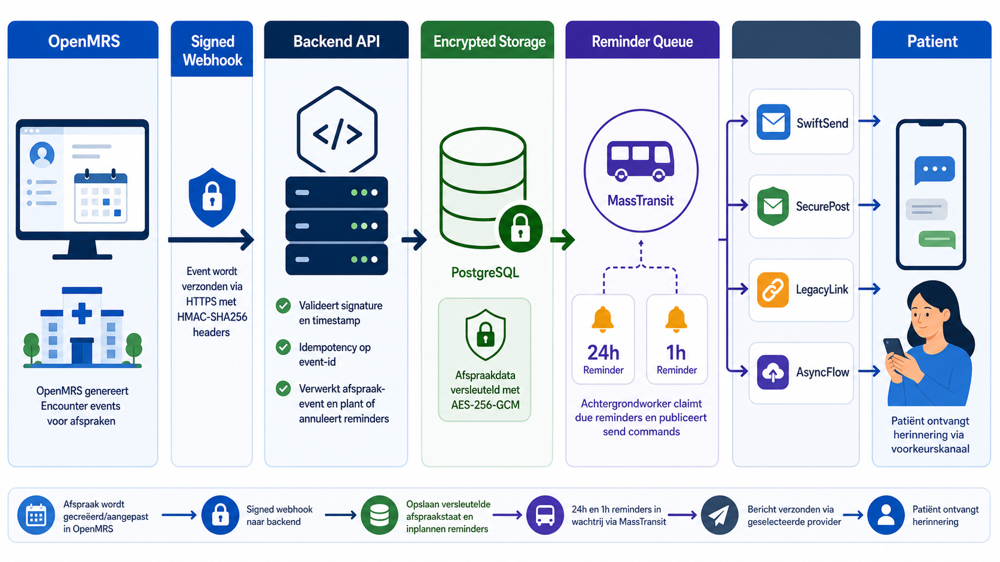

# OpenMRS naar backend webhook

De OpenMRS LU1 distro bevat een webhookmodule die `Encounter`-events naar de backend stuurt. De backend gebruikt deze events om geplande 24u- en 1u-herinneringen aan te maken of te annuleren.



## Endpoint

`POST /api/webhooks/openmrs/appointments`

| Header | Verplicht | Betekenis |
|---|---:|---|
| `X-OpenMRS-Event-Id` | ja | Unieke idempotency key per OpenMRS-event |
| `X-OpenMRS-Event-Type` | ja | Bijvoorbeeld `CREATED`, `UPDATED`, `VOIDED`, `UNVOIDED` |
| `X-OpenMRS-Timestamp` | ja | UTC timestamp in ISO-8601 |
| `X-OpenMRS-Organization-Id` | ja | Tenant/organisatie die de afspraak bezit |
| `X-OpenMRS-Signature` | ja | `sha256=<hex hmac>` |

Signature:

```text
hex(hmac_sha256(secret, timestamp + "." + raw_json_body))
```

## Payload

```json
{
  "encounterId": "enc-123",
  "patientId": "patient-456",
  "start": "2026-05-25T10:00:00Z",
  "end": "2026-05-25T10:20:00Z",
  "status": "planned",
  "patientDisplay": "Niet loggen",
  "serviceType": "Controle",
  "location": "Polikliniek A",
  "instructions": "Medicijnen meenemen"
}
```

Gevoelige velden worden encrypted opgeslagen. De backend bewaart daarnaast een webhook-eventlog met event-id, event-type, organisatie, resource-id, payloadhash en verwerkingstatus.

## Verwerking

1. Backend valideert timestamp en HMAC.
2. Backend dedupliceert op `X-OpenMRS-Event-Id`.
3. Backend upsert appointment notification state.
4. Bij actieve afspraak worden 24u- en 1u-reminders ingepland als die nog in de toekomst liggen.
5. Bij geannuleerde of voided afspraak worden pending reminders geannuleerd.
6. De `ReminderWorker` claimt due reminders en publiceert `SendReminderCommand` via MassTransit.

## Voorbeeldrequest

```bash
BODY='{"encounterId":"enc-123","patientId":"patient-456","start":"2026-05-25T10:00:00Z","status":"planned"}'
TS="$(date -u +"%Y-%m-%dT%H:%M:%SZ")"
SIG="$(printf "%s.%s" "$TS" "$BODY" | openssl dgst -sha256 -hmac "$OPENMRS_WEBHOOK_SECRET" -hex | sed 's/^.* //')"

curl -X POST http://localhost:5111/api/webhooks/openmrs/appointments \
  -H "Content-Type: application/json" \
  -H "X-OpenMRS-Event-Id: evt-123" \
  -H "X-OpenMRS-Event-Type: CREATED" \
  -H "X-OpenMRS-Timestamp: $TS" \
  -H "X-OpenMRS-Organization-Id: org-avans" \
  -H "X-OpenMRS-Signature: sha256=$SIG" \
  -d "$BODY"
```
